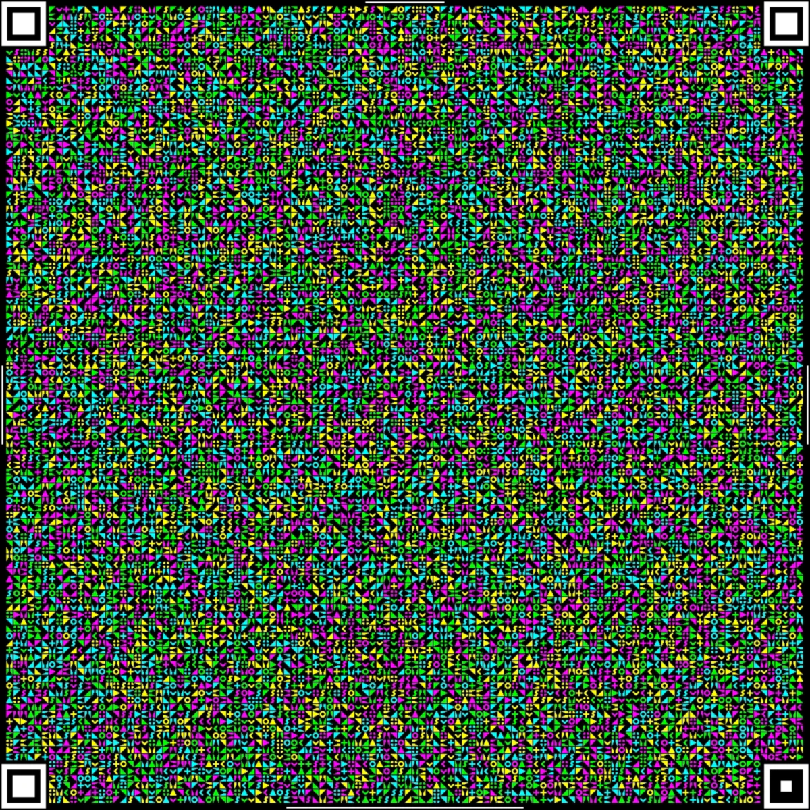
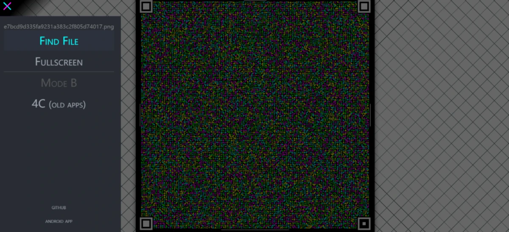
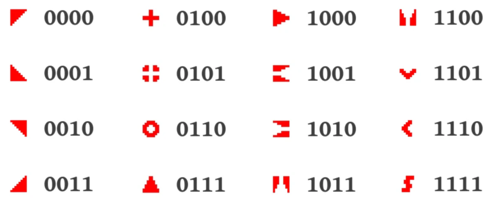
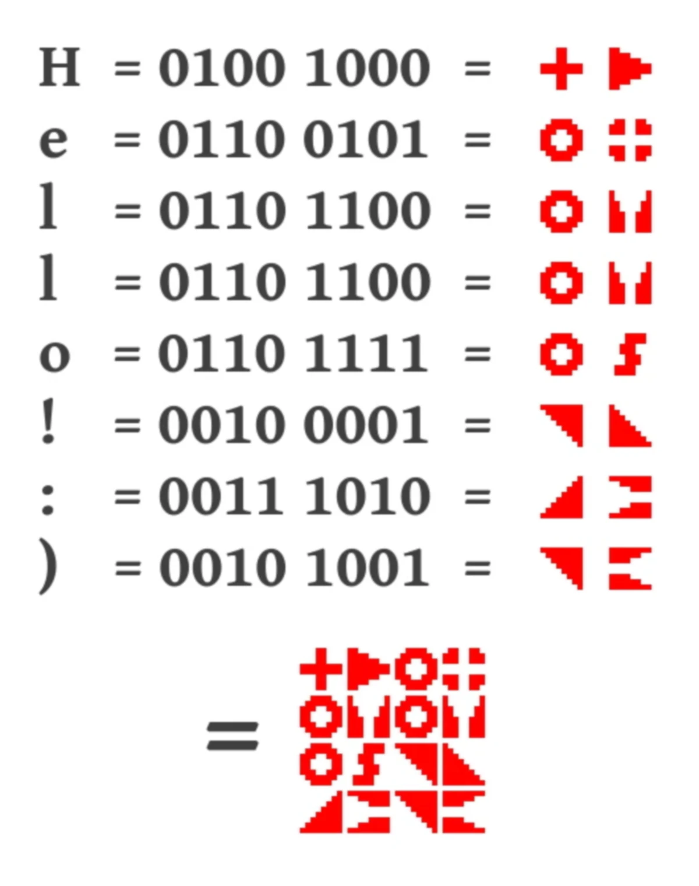

I previously shared a project that uses paper to store files — PaperBak. Recently, I discovered another project that allows file transmission using a camera — Cimbar. Let's start with a demonstration.

<video src="../../../posts/cimbar-introduction/video.mp4" controls="controls" height="20%"></video>


I've been watching "Zetsuen no Tempest" lately, and it's quite good. By the way, I haven't seen the "[Hime cut](https://en.wikipedia.org/wiki/Hime_cut)" hairstyle used by the main character in a long time; it feels like it was popular ten years ago.



Project link: **https://github.com/sz3/libcimbar**



## How to Use



Open  https://cimbar.org/ and select the file you want to transmit. This web interface is just an HTML file, so as long as you can download it, you can use it offline. However, it seems that the browser can only handle files up to 10MB, so larger files won't work.

Then, use the official decoding program from https://github.com/sz3/cfc/releases to scan the generated QR code, and just wait for the progress bar to finish.

The transmission speed is reportedly 106KB/s, which is quite fast.

## What’s the Principle Behind It?

**Image Hashing**

The core of Cimbar is based on **image hashing** technology. Image hashing is a method of converting image content into a fixed-length hash value. In Cimbar, image hashing is implemented using a simple threshold algorithm: if a pixel is set to black, it is represented as 1; otherwise, it is 0. This 8x8 grid is ultimately encoded into a 64-bit number, read from left to right and top to bottom. Although this method is not complex, it is still very efficient.

The following image shows a set of symbols used for encoding, each representing 4 bits of data:



Each symbol is spaced at least 20 bits apart in the hash space, ensuring that even if the image is blurred or interfered with, the symbols can still be clearly distinguished.



## How to Encode?

The encoding process of Cimbar is like placing pieces of data into a large puzzle, where each piece represents several "bits" (the smallest unit of data storage in computers). Each piece not only has a pattern but also a color, allowing us to increase the encoding capacity by using different colors.

The simplified encoding process looks like this:

```python
for each data group in file:
    find the next position
    place the corresponding piece
```

Cimbar can encode approximately 9300 bytes of data into a 1024x1024 pixel image.

## Error Correction and Interleaving

During data transmission, issues may arise, such as images becoming blurry or corrupted. To prevent these problems from affecting data integrity, Cimbar uses **error correction codes (like Reed-Solomon)**. This is akin to adding a layer of "backup" to each puzzle piece, allowing Cimbar to recover information even if part of the data is lost.

For example, if we have 125 bytes of data, Cimbar will add an additional 30 bytes of error correction data. This way, even if some information is lost, we still have 30 bytes of "insurance" to recover it.

Moreover, since image errors often cluster in adjacent areas (like a part of the image being obscured by a finger), Cimbar employs data interleaving techniques to distribute error correction blocks across different regions of the image, thereby reducing the impact of localized errors on overall decoding.

### Fountain Coding

Fountain coding is one of the key components of the entire process. For files larger than 7500 bytes, Cimbar implements Fountain coding, an efficient method for segmented data transmission. Even if some data frames are lost, Cimbar can still reconstruct the original file using the received N+1 data frames.

Its design is inspired by the image of a fountain's water flow: you can draw water from a fountain without needing to catch every drop; as long as you collect enough water, you can fill your cup.

In data transmission, the basic principle of Fountain coding is to divide the original data into several small pieces, then generate countless encoded blocks (referred to as "drops") through encoding. The receiver does not need to receive all these "drops"; as long as they receive enough encoded blocks, they can reconstruct the original data.

The advantages of Fountain coding include:

- The decoder can receive data from multiple frames in any order.
- As long as enough frames are received, the file can be successfully decoded.

<video src="../../../posts/cimbar-introduction/video2.webm" controls="controls" height="20%"></video>

**The Implementation of Fountain Coding** may seem complex, but its core principles are quite straightforward. Here’s a brief overview of its working steps:

1. **Data Chunking**

First, the sender divides the original data into multiple equal-sized data chunks, each referred to as a "source block."

2. **Encoding Generation**

Using a method called **XOR operation**, the sender can generate an infinite number of **encoded blocks**. Each encoded block is formed by combining several source blocks, achieved by performing XOR operations on randomly selected source blocks to create a new encoded block. Each encoded block can be viewed as a mixture of multiple source blocks.

3. **Transmission**

The sender continuously generates and sends these encoded blocks. The receiver does not need to receive all encoded blocks; they only need to receive a sufficient number of encoded blocks (usually slightly more than the number of source blocks) to begin decoding.

4. **Decoding**

The receiver collects enough encoded blocks and gradually uses the **XOR inverse operation** to recover the original data blocks. Each received encoded block is actually a combination of certain source blocks, so once the receiver has enough encoded blocks, they can deduce all the original blocks.

5. **Stopping Condition**

The transmission can stop once the receiver has decoded all the original data blocks. Therefore, Fountain coding does not require the sender to specifically send certain encoded blocks, and the receiver does not need to receive them in order; as long as the number of encoded blocks is sufficient, the data can be restored.

### Decoding Process

Cimbar's decoder first needs to locate the encoded tile grid within the image, followed by precise extraction through 2D image transformation. The task of the decoder is more complex than that of the encoder; it must handle issues like distortion and blurriness while also minimizing errors through image hash calculations.

This process determines the decoding priority based on the distance metric of the image hash, starting with the blocks that have the highest confidence and gradually completing the decoding of the entire image.
