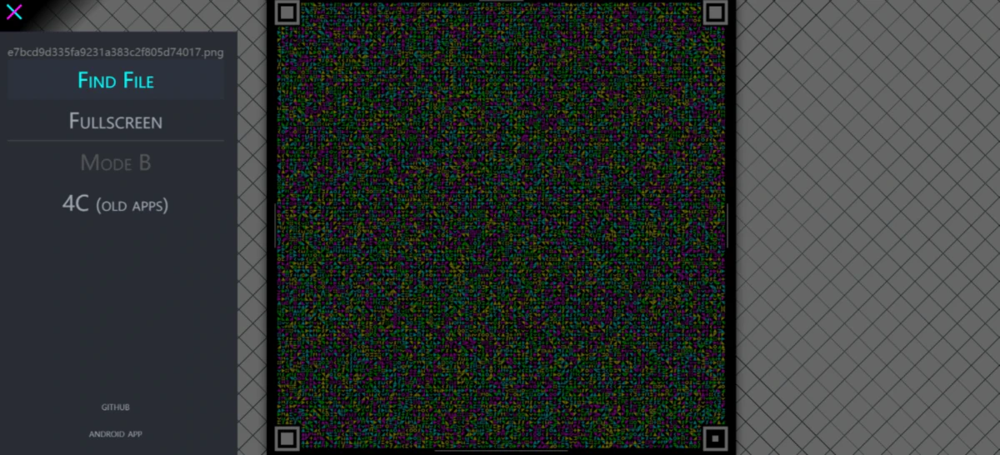
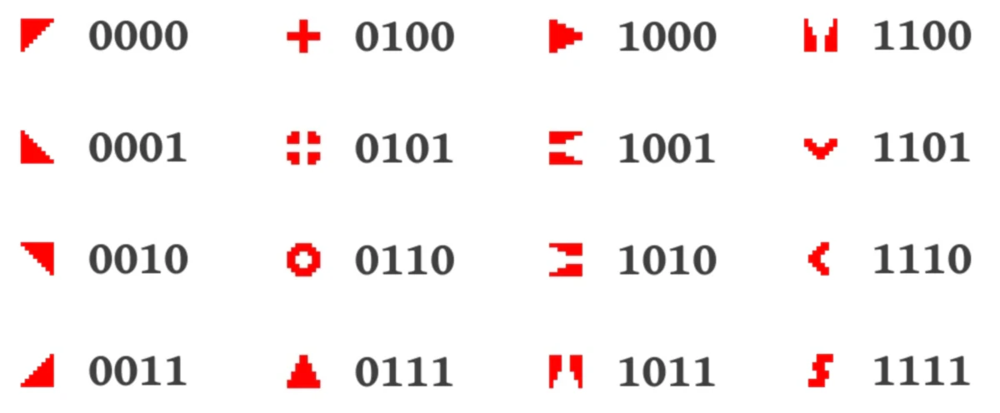

我之前发过一个用纸存储文件的项目 —— PaperBak，最近又让我发现一个用摄像头就可以传输文件的项目 —— Cimbar，先上效果。

<video src="video.mp4" controls="controls" height="20%"></video>


最近在看《绝园的暴风雨》，挺好看的。话说[公主切](https://zh.wikipedia.org/wiki/%E5%A7%AC%E9%AB%AE%E5%BC%8F)好久都没见有番的主角用了，感觉十年前还是比较流行的。


项目地址：**https://github.com/**



操作方法



打开  https://cimbar.org/  选择需要传输的文件，这个网页端就是一个 html 文件，无网络环境下只要想办法下载下来这个网页就能用，但是浏览器似乎只能操作 10M 的文件，所以太大的也不行。

然后用它官方的解码程序 https://github.com/sz3/cfc/releases  对准生成的二维码，等进度条走完就行了。

传输速度据说有 106KB/s，还是很快的。

## 原理是啥？

**图像哈希**

Cimbar 的核心基于**图像哈希**技术。图像哈希是一种将图片内容转换为固定长度哈希值的方法。在 Cimbar 中，图像哈希通过简单的阈值算法实现：如果像素被设置为黑色，则为 1，否则为 0。这种 8x8 的网格最终被编码为 64 位的数字，从左至右、从上至下读取。尽管这种方法并不复杂，但是还是很高效的。

下图展示了一组用于编码的符号，它们分别代表了 4 位数据：



每个符号在哈希空间内与其他符号相隔至少 20 位，这确保了即使图像模糊或受到其他干扰时，也能清晰区分各个符号。


## 怎么编码？

Cimbar 的编码过程就像是把数据一块一块地放进一个大拼图里。每一个方块代表几个“比特”（也就是二进制位，计算机用来存储数据的最小单位）。每个方块不仅有图案，还有颜色，这样一来，我们就可以用不同的颜色来增加编码的容量。

简化版的编码过程大致是这样：

```python
for 每一组数据 in 文件:
找到下一个位置
把对应的方块放上去
```

Cimbar 可以把大约 9300 字节的数据编码成一张 1024x1024 像素的图片。

## 错误校正与交织处理

在传输数据的过程中，可能会出现一些问题，比如图像变模糊或者损坏。为了防止这些问题影响数据的完整性，Cimbar 使用了**纠错码（如 Reed-Solomon）**。这就像是给每一块拼图加了一层“备份”，即使一部分数据丢失，Cimbar 也能通过这些备份来恢复信息。

举个例子，如果我们有 125 字节的数据，Cimbar 会再加上 30 字节的纠错数据。这样即使部分信息丢失了，我们还是有 30 字节的“保险”来恢复它。

此外，由于图像错误往往集中在相邻区域（如图像的一部分被手指遮挡），Cimbar 还采用了数据交织技术，将错误校正块分布在图像的不同区域，以减少局部错误对整体解码的影响。

### Fountain 编码（喷泉码）

喷泉码是整个过程中的关键之一。对于大于 7500 字节的文件，Cimbar 实现了 Fountain 编码，这是一种高效的分段数据传输方式。即使有部分数据帧丢失，Cimbar 仍然可以通过接收到的 N+1 个数据帧重构出原始文件。

它的设计灵感来源于喷泉水流的形象：你可以从喷泉中随意接水，不需要每一滴水都接到，只要接到足够的水，就能填满你的杯子。

在数据传输中，喷泉码的基本工作原理是将原始数据分成若干小块，随后通过编码生成无数个编码块（称为“水滴”）。接收方不必接收到所有这些“水滴”，只要收到足够多的编码块，就能还原出原始数据。

Fountain 编码的优点在于：

- 解码器可以从多个帧中任意顺序接收数据
- 只要接收到足够的帧，就能成功解码文件

<video src="video2.webm" controls="controls" height="20%"></video>

**喷泉码的实现**过程虽然看起来复杂，但核心原理其实很简洁。这里简要介绍其工作步骤：

1. **数据分块**

首先，发送方将原始数据分成多个等大小的数据块，每个数据块称为一个 "原始块"。

2. **编码生成**

通过一种叫  **异或运算**（XOR）的方式，发送方可以生成无限多个  **编码块**。每个编码块是从若干原始块组合而成，即通过将随机选择的原始块进行异或操作，得到一个新的编码块。每个编码块可以看作是多个原始块的混合。

3. **传输**

发送方不断生成并发送这些编码块。接收方无需接收所有编码块，只需要收到一定数量的编码块（通常比原始块数量多一些），就可以开始解码。

4. **解码**

接收方通过收集足够多的编码块，逐步使用  **异或逆运算**  恢复出原始数据块。每个收到的编码块实际上是某些原始块的组合，所以当接收方收到足够的编码块后，它可以反推出所有的原始块。

5. **停止条件**

当接收方解码出所有原始数据块后，传输可以停止。因此，喷泉码不需要发送方确定地发送特定的编码块，接收方也不需要按顺序接收，只要编码块的数量足够，就能恢复数据。

### 解码过程

Cimbar 的解码器首先需要在图像中定位编码的瓷砖网格，随后通过 2D 图像转换进行精确提取。解码器的任务比编码器更为复杂，它不仅要处理失真、模糊等问题，还要通过图像哈希计算，尽量减少误码。

该流程通过图像哈希的距离指标确定解码的优先级，从最有信心的块开始解码，逐步完成整个图像的解码。
