<video src="../../../posts/esp32-touchpad/video.webm" controls="controls" height="20%"></video>

## Introduction

I personally enjoy compact devices, including small keyboards, mice, handheld consoles, and so on. Recently, I found the smallest scissor-switch keyboard available, which is only 7 inches in size and even has backlighting:

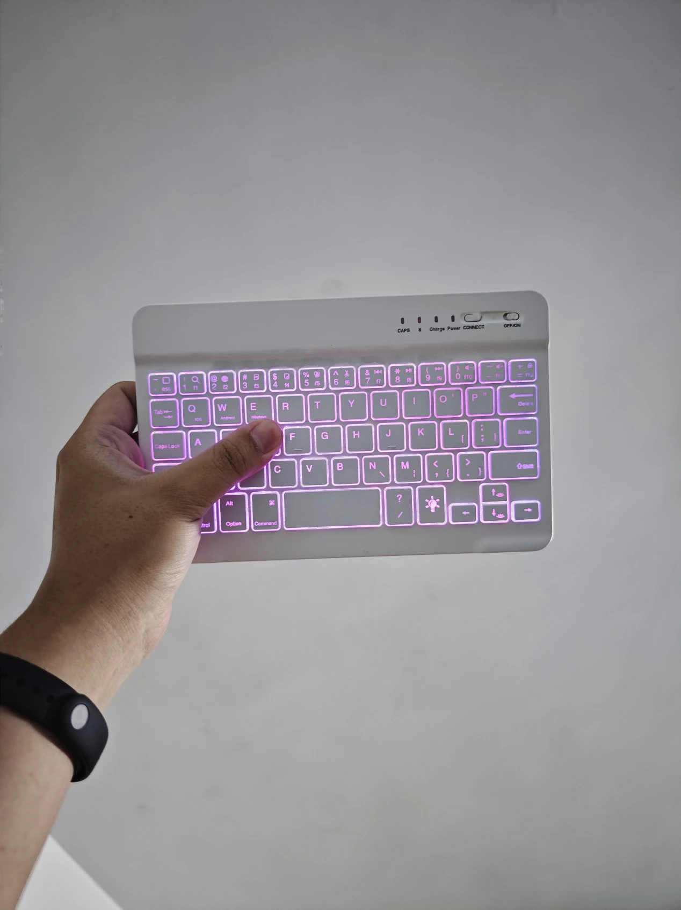

I really like this keyboard, but it has one drawback: it's still too large. Although its thickness is less than 5mm, as shown in the picture, there is still quite a bit of unused space at the front and back. It would be great if it had a touchpad as well. So, I started planning how to add one. Since the keyboard is still functional, I decided not to ruin it and instead bought a touchpad to work on first. I found the cheapest touchpad available, the TM2334, which cost only 16 yuan including shipping. This touchpad was used in Lenovo S41 laptops from 2012-2013, supports multi-touch, and has a great feel:

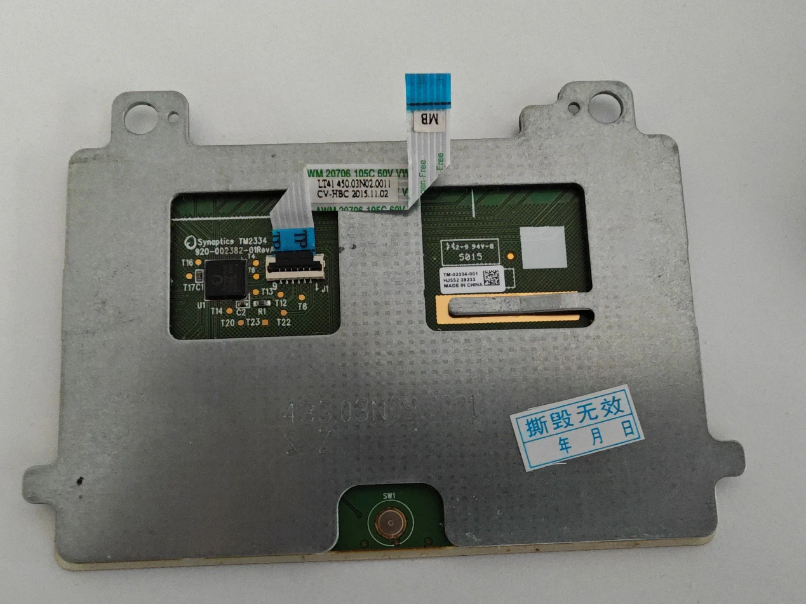

The next step was to understand how the touchpad works.

## Surprisingly, It's PS/2

Upon receiving the touchpad, I realized that it is a commercial product and not a module, so I couldn't find any documentation. I started searching to see if anyone had worked with this model. To my surprise, I found some information:

https://forum.level1techs.com/t/touchpad-ps-2-pinout-help/139088

The first post I found detailed how the author wanted to use this touchpad as a PS/2 device. They connected several test points but still couldn't drive it using pure PS/2 methods:

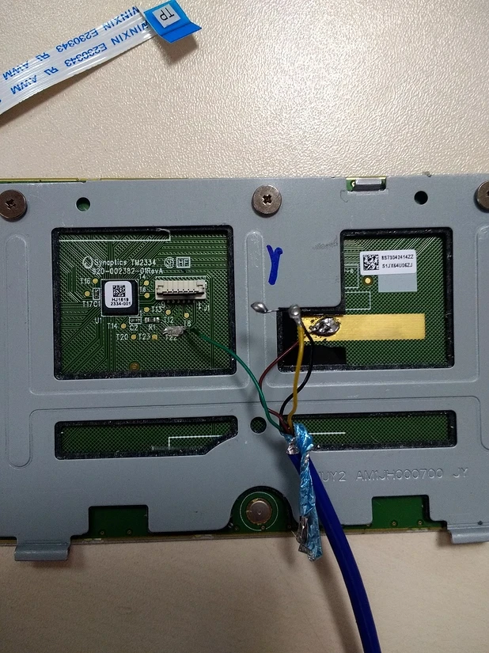

Another user provided the pinout definition and soldered it to a PS/2 connector, but they were also unable to drive it:

https://www.eevblog.com/forum/projects/usb-touchpad-synaptics-tm2334/

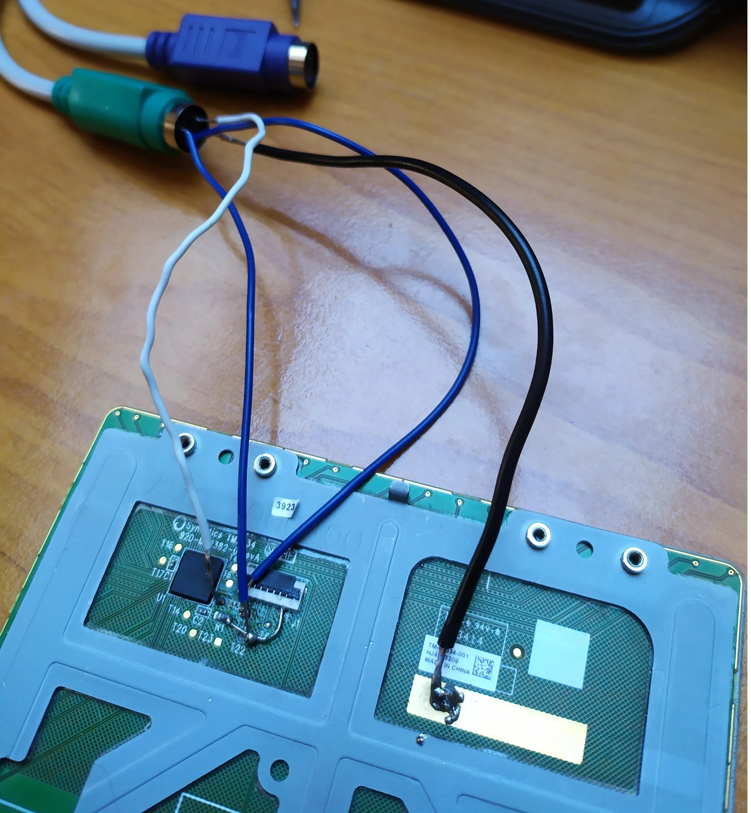

This user was quite stubborn, firmly believing that it could only be driven directly via PS/2. However, we had a different approach; we wanted to communicate via Bluetooth, so we weren't bound by those limitations. I dug out my roommate's D1 R32 development board, which I had borrowed during my graduation project. This board looks similar to an Arduino UNO but is powered by an ESP32, a dual-core processor with a frequency of 240MHz, supporting both WiFi and Bluetooth connections. Its performance is quite robust, making it perfect for development:

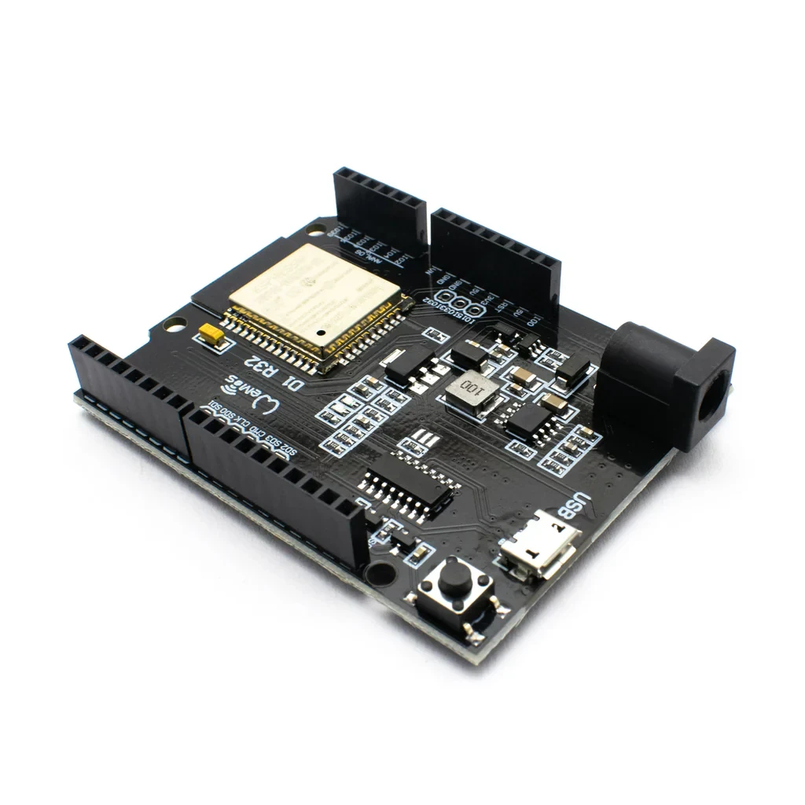

To connect the touchpad, we didn't need to be as rough as the users abroad; we could simply buy a 6-pin FPC connector. The first time I did this, I lacked experience and saw options for 0.5 and 1.0 mm pitch connectors. I mistakenly thought the latter referred to the spacing of the holes and wondered why I would need such a wide connector. It turned out that 0.5 mm referred to the width of the ribbon cable, while the touchpad used a 1.0 mm ribbon. Fortunately, the connector I bought had a 0.5 mm pitch on one side and 1.0 mm on the other, so I just needed to buy a 1.0 mm connector to solder on, which was quite simple and saved me from wasting money.

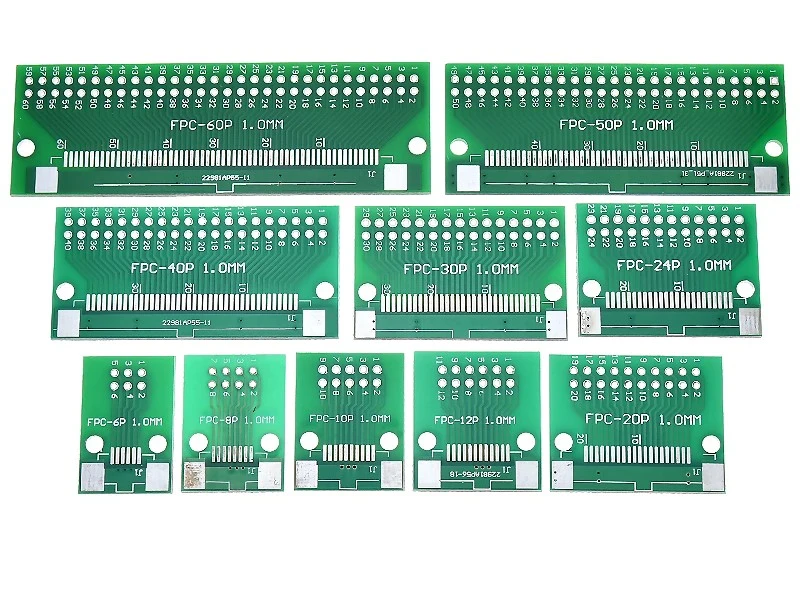

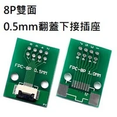

Based on the definitions provided in the previous posts, we learned the pinout for the ribbon cable:

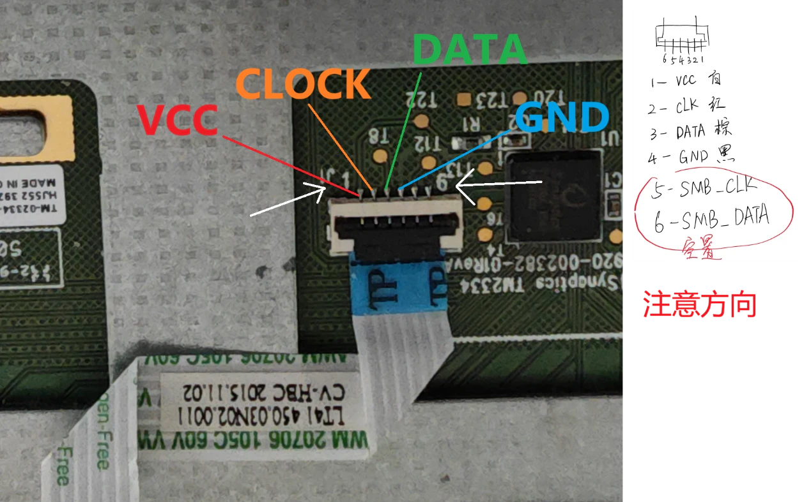

1.  **+3VS**: This is the 3V power supply pin, labeled as “+3 Volt Supply.” It provides power to the related circuits (such as the touchpad).
2.  **TP_CLK (Touchpad Clock)**: This is the clock signal pin for the touchpad. The clock signal is used to synchronize data transmission and reception.
3.  **TP_DATA (Touchpad Data)**: This is the data transmission pin for the touchpad, responsible for transmitting data between the touchpad and the main controller.
4.  **GND**: Ground pin, providing a reference point for the electrical circuit. All current returns to this pin.
5.  **SMB_CLK (SMBus Clock)**: This is the clock pin for the System Management Bus (SMBus). SMBus is used for communication with low-bandwidth devices, such as batteries or sensors.
6.  **SMB_DATA (SMBus Data)**: This is the data pin for the SMBus, used for data transmission between SMBus devices.

We must pay close attention to the orientation, especially the markings for pins 1 and 6. Pins 5 and 6 are used for the computer motherboard, which we won't need. Additionally, it's important to note that not every touchpad has the same pinout; if you plan to buy a random touchpad for modification, you'll need to look up the relevant information online.

## Understanding PS/2 Basics

First, let's cover some basic knowledge about PS/2. A standard PS/2 connector looks like this:

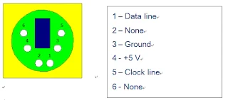

The power and ground lines are straightforward. The **clock line (CLK)** is used to synchronize data transmission and is controlled by either the device or the host as needed. The **data line (DATA)** is responsible for transmitting data bits between the host and the device. When a PS/2 device is idle, both the clock and data pins are pulled high. When the host wants to send data to the device, it pulls down both CLK and DATA to indicate a request to send data. The device can then control the CLK line to send data back to the host. Therefore, we can attach an interrupt to the clock pin, triggering a read signal on the falling edge to read signals from the PS/2 device.

The PS/2 data frame is structured as follows:

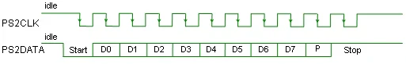

- **Start Bit**: Always 0 (LOW).
- **Data Bits**: 8 bits, with the least significant bit (LSB) sent first.
- **Parity Bit (P)**: Ensures odd parity (the total number of 1s is odd).
- **Stop Bit**: Always 1 (HIGH).

Now that we understand how to read data, the next step is to initialize a Synaptics touchpad.

## Synaptics, Let's Get Started!

In fact, you can initialize a Synaptics touchpad using the standard PS/2 protocol because Synaptics touchpads are inherently PS/2 compatible devices:

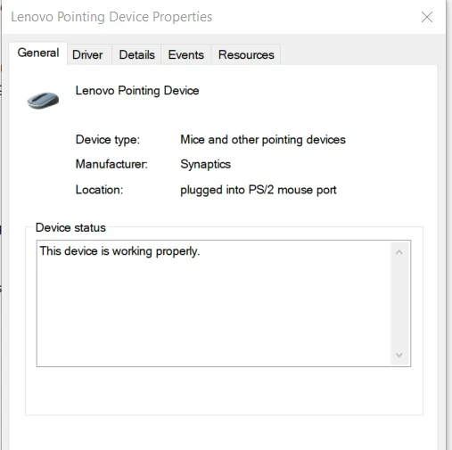

However, the downside is that while PS/2 mice have left and right buttons and scrolling functionality, without drivers, the Synaptics touchpad can only move up and down or left and right and use the left mouse button. This is barely functional, and anything beyond that is out of the question. As for two-finger taps being recognized as right-clicks or two-finger scrolling being recognized as scrolling, forget about it; those features simply won't trigger. To use multi-finger gestures, you must send special initialization commands during setup. Unfortunately, there is very little information available online, but after persistent searching, I found a perfect resource that met my needs:

https://github.com/delingren/synaptics_touchpad

The person who submitted this code did so around the same time I had this idea, in July. They implemented a driver for a wired Synaptics touchpad microcontroller, which is fantastic:

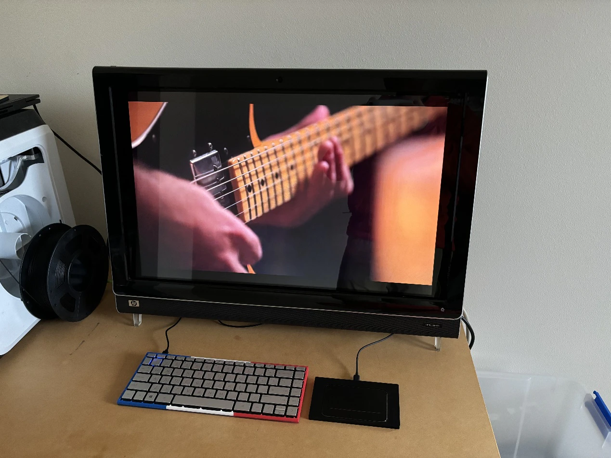

Now, let's use their program to explain what enhancements Synaptics has added to the PS/2 protocol.

During the BIOS startup process, a standard PS/2 mouse operates as follows: the host sends a "Get Device ID" command (0xF2) and waits for a response. If a standard PS/2 mouse is connected, it will return an ACK (0xFA) and respond with the device ID 0x00. In this case, the host recognizes that the mouse indeed has a scroll wheel and continues to treat it as a standard PS/2 mouse.

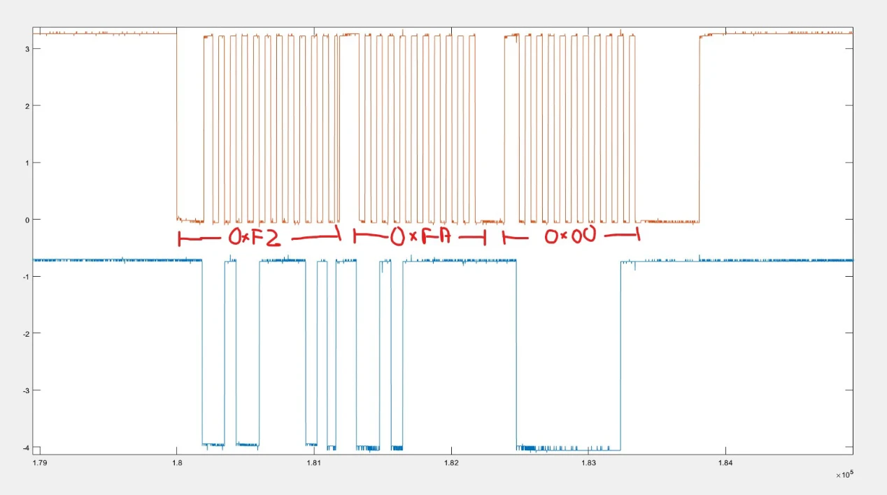

Next, we need to obtain a series of information from the Synaptics touchpad to facilitate the next steps:

1. **Getting Version Information**:
   1. Use `status_request(0x00, result)` to obtain the touchpad version information.
      1. `infoMajor`: The major version number, taken from the lower 4 bits of `result[2]`.
      2. `infoMinor`: The minor version number, taken from `result[0]`.
2. **Getting Capability Information**:

   1. Use `status_request(0x02, result)` to get the capability information of the touchpad.
      1. `capExtended`: Indicates whether extended features are supported, from the highest bit of `result[0]`.
   2. If extended features are supported, parse the following:
      1. `nExtendedQueries`: The number of extended queries.
      2. `middleButton`: Indicates whether a middle button is supported, from the 2nd bit of `result[0]`.
      3. `fourButtons`: Indicates whether four buttons are supported, from the 3rd bit of `result[2]`.
      4. `multiFinger`: Indicates whether multi-finger support is available, from the 1st bit of `result[2]`.
      5. `palmDetect`: Indicates whether palm detection is supported, from the 0th bit of `result[2]`.

3. **Getting Unit Information**:

   1. Use `status_request(0x08, result)` to obtain the unit information of the touchpad.
      1. `units_per_mm_x`: The number of units per millimeter in the X direction, from `result[0]`.
      2. `units_per_mm_y`: The number of units per millimeter in the Y direction, from `result[2]`.

4. **Getting Clickpad Information**:
   1. Use `status_request(0x0C, result)` to get the type information of the clickpad.
   2. `coveredPadGest`: Indicates whether covered pad gestures are supported, from the highest bit of `result[0]`.
   3. `clickpad_type`: The type of the touchpad, derived from the bits of `result[0]` and `result[1]`.
   4. `clickPadInfo`: An array describing the type of the touchpad.
   5. `advGest`: Indicates whether advanced gestures are supported, from the 3rd bit of `result[0]`.
   6. `clearPad`: Indicates whether clear pad functionality is supported, from the 2nd bit of `result[0]`.

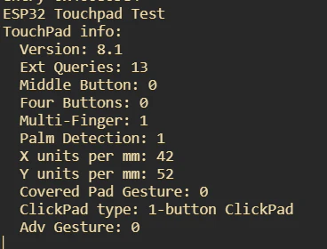

After gathering this information, we can configure the touchpad's mode. It seems the author also spent considerable time figuring out how to set the touchpad's mode and ultimately chose to reference the initialization command sequences from other projects:

> // Reference: 4.3. Mode Byte 
> 
> // For some reason, I couldn't get the touchpad to report extended W mode packets. 
> 
> // After some research, I found the solution in the VoodooPS2 driver (a touchpad driver for Hackintosh). 
> 
> // This sequence sets absolute mode, high speed, W mode, and EW mode. 
> 
> // F5 
> 
> // E6, E6, E8, 03, E8, 00, E8, 01, E8, 01, F3, 14 
> 
> // E6, E6, E8, 00, E8, 00, E8, 00, E8, 03, F3, C8 
> 
> // F4

In the program, this is reflected as follows:

- Two `SETSCALE11` (set scale to 1:1, 0xE6) commands.
- Sending a special command `0xC5`.
- Setting the sampling rate to `0x14`.
- Sending two more `SETSCALE11` commands.
- Sending a special command `0x03`.
- Setting the sampling rate to `0xC8`.

Although it may not be entirely clear, this indeed enables the normal operation of the touchpad. For more details, you can refer to the Synaptics touchpad documentation: [Synaptics Touchpad Documentation](https://github.com/delingren/synaptics_touchpad/blob/main/touchpad_RevB.pdf). However, I skimmed through it and didn't find a corresponding method.

Regarding W mode, the documentation states:

1. **When the Wmode bit is set to 1**:
   - The touchpad **does not report gesture information**.
   - In this case, bit 2 is automatically used to report **EWmode (Extended W mode)**.
   - EWmode provides extended W mode functionality; in EW mode, the traditional X, Y, Z data no longer have their previous meanings and are redefined based on the EW mode packet codes.
2. **When the Wmode bit is set to 0**:
   - The touchpad **reports gesture information**.
   - In this case, bit 2 indicates **DisGest (Disable Gesture)**.
   - If the DisGest bit is 0, it means **click and swipe gesture processing is enabled**.
   - If the DisGest bit is 1, it means **click and swipe gesture detection is disabled**.
   - When the DisGest bit is 1, in relative mode, the mouse packet will report the actual physical button states, while in absolute mode, the Gesture bit in the packet will always be 0 (i.e., no gesture reporting).

Once initialization is complete, we only need to process the information sent by the touchpad according to the PS/2 device's data reading method. The touchpad, as a PS/2 device, communicates with the host via the clock and data lines. When the touchpad needs to send data, it sends a synchronization signal through the clock line, and we only need to read the state of the data line on the falling edge of the clock line to obtain the complete data packet. Each data packet contains 48 bits of data, which record information such as the position, pressure, and width of fingers on the touchpad. The returned data packets mainly come in two types:

- **Primary Packet**: Used to transmit basic touch information, such as the number of fingers, coordinates, pressure, etc.
  - **Byte 1 (Bits 47-40)**:
    - Bit 47: Synchronization bit, usually 1.
    - Bits 46-44: Number of fingers or other flag bits.
    - Bits 43-40: May be used for button states, touch types, etc.
  - **Byte 2 (Bits 39-32)**:
    - Z value, high 8 bits, representing pressure.
  - **Bytes 3 and 4 (Bits 31-16)**:
    - X coordinate, high 16 bits.
  - **Bytes 5 and 6 (Bits 15-0)**:
    - Y coordinate, high 16 bits.

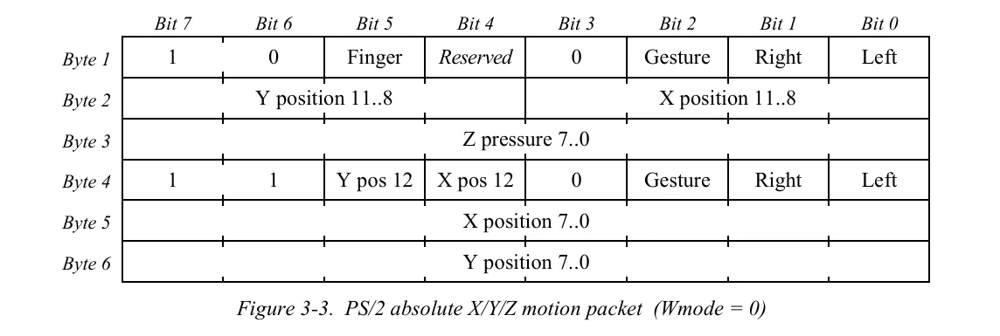

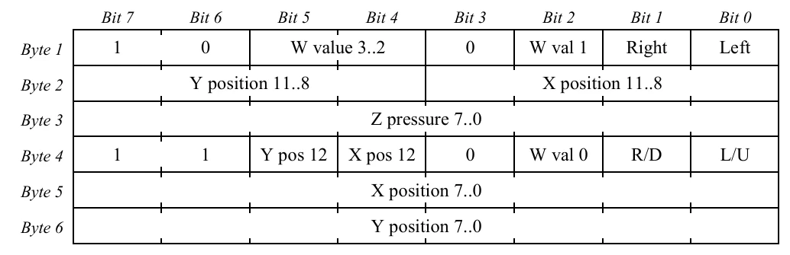

- **Extended Packet**: Used to transmit more detailed information, supporting multi-finger operations, special gestures, etc.
  - **Byte 1 (Bits 47-40)**:
    - Specific flag bits used to distinguish the type of extended packet.
  - **Byte 2 (Bits 39-32)**:
    - Extended information, such as function codes, number of fingers, etc.
  - **Remaining Bytes**:
    - Depending on the type of extended packet, it contains different content, such as additional coordinates, gesture information, etc.

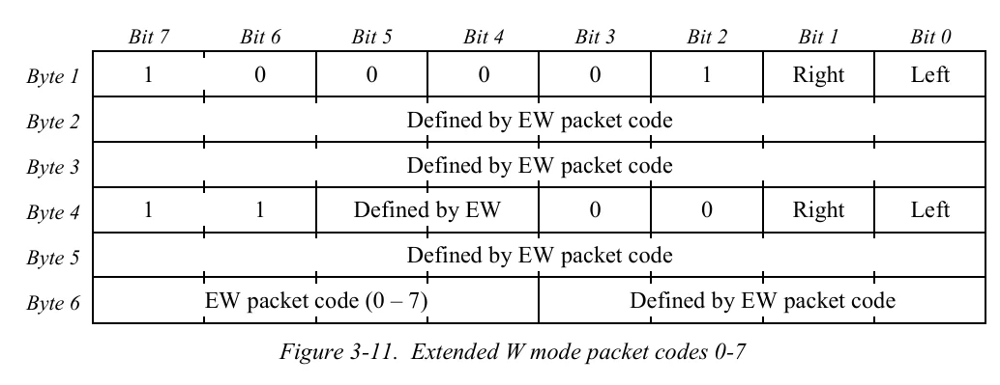

To determine whether it is a primary packet or an extended packet, you can check the W mode, specifically looking at bits 2, 4, 5, and bit 26.

## Bluetooth Integration

Integrating Bluetooth is quite simple; you can directly use the library available at https://github.com/T-vK/ESP32-BLE-Mouse.

Since the ESP32 is a dual-core processor, I placed the part that processes touchpad information on core 0, while sending information via Bluetooth runs on core 1 by default. I mainly utilized the multitasking mechanism provided by FreeRTOS on the ESP32 to achieve the following goals:

- **Data Processing and Task Separation**: Separating the touchpad data reception and processing into different tasks to enhance the system's responsiveness and stability.
- **Asynchronous Processing**: Implementing asynchronous data transfer through tasks and queues to avoid heavy processing in interrupts.

Since the touchpad sends data to the ESP32 via interrupts, the interrupt service routine `byte_received` receives the data and needs to pass it to a task for processing. Since only one byte can be received at a time, the six consecutive bytes must be concatenated to form a complete data packet. Once a complete data packet is received, it is sent to the `mouseEventQueue` using `xQueueSendFromISR`.

After that, in the processing function, we use `xQueueReceive` to receive the packet from the queue, with a timeout of 10 milliseconds. Based on the contents of the packet, we determine its type and call the corresponding parsing function. If Bluetooth is already connected, the mouse event is sent via Bluetooth. This way, we achieve Bluetooth integration for the data.

## Implementing Complex Gestures and Optimization

### About the Data Packets

After connecting the touchpad as required, every time a touch occurs, the touchpad sends a 6-byte data packet to the host. These packets contain information such as finger position, pressure (the pressure value reported by this touchpad corresponds to the touch area), and width. The TM2334 touchpad can detect a maximum of three fingers, so gestures involving more than three fingers cannot be recognized.

Due to the inevitable noise in communication, packets may be lost or altered. Capturing every data frame is not critical; losing one or two frames is not a significant issue. Additionally, some packets have unique characteristics (for example, fixed bits at certain positions) that can be used for synchronization and recovery. Therefore, if an unexpected packet is received, I will continue to discard packets until resynchronization occurs. In simple terms, I check the 0th and 24th bytes of the packet to ensure that the 7th bit of the 0th byte is 1, and the 6th and 3rd bits are 0; and that the 7th and 6th bits of the 24th byte are 1, and the 3rd bit is 0. The specific reason for this is borrowed from the VooDooPS2 driver; I am not entirely clear on the details, and I don't want to delve deeply into the documentation to find out why. I just need to know that this is the case.

### Desired Features

**I mainly want to implement the following features, and once these are achieved, daily use should be problem-free:**

- Mouse movement
- Pressing the lower-left area as the left mouse button and the lower-right area as the right mouse button (to be implemented after casing; currently, it is quite difficult to press)
- Light taps as clicks
  - Single-finger tap as the left mouse button
  - Two-finger tap as the right mouse button
  - Three-finger tap as the middle mouse button
  - Palm rejection to avoid accidental touches
- Scrolling
  - Two-finger vertical swipes for vertical scrolling
  - Two-finger horizontal swipes for horizontal scrolling
- Three-finger gestures
  - Three-finger horizontal swipes to switch applications
  - Three-finger vertical swipes to show the desktop or return to the application
- Lightly tap and then move the finger to implement dragging
- Zooming in and out
- Sleep mode

**Among these, three-finger gestures are not natively supported by HID devices, so I may need to refer to Microsoft's documentation (for switching applications, I will likely send Alt + Tap using the keyboard, and then send up, down, left, right commands; showing the desktop, etc.). This will be discussed later, but for now, let's focus on the other features.**

## Actual Implementation

If we faithfully report finger positions in every frame, the cursor will experience a lot of jitter due to the inherent noise and instability of human fingers. To address this issue, we can implement some optimization strategies as follows:

- **Averaging**: Instead of reporting the finger position in every frame, I track the average of the last n frames to eliminate sudden movements. Currently, I have set this to 20 frames. A lower value increases precision, but the cursor may also jitter more.

- **Noise Threshold**: If the increment between two frames is below a certain threshold, it is considered a false touch. This value is empirical and needs to be determined through multiple experiments, as it varies with different touchpads. Currently, I have set this value to 0.08mm.

- **Sticky Finger Threshold**: When a finger remains stationary, I use a higher threshold to make it feel "sticky" at first, but smoother when moving.

For scrolling, since the HID protocol reports using integers, even a gentle swipe can only report a value of 1 and cannot report decimals. To achieve fast and precise scrolling, the implementation is quite simple: when the finger moves slowly and the movement is small, I generate a report only every few frames, with a movement value of 1. Once the speed exceeds a certain threshold, I assume the user's intent is to scroll quickly over a large area. In this case, I report in every frame, with the movement value proportional to the actual movement.

For light taps as clicks, the logic is as follows: when a finger is detected as just pressed down (the number of fingers in the previous frame is 0, and in the current frame it is not 0), I record the frame number when pressed and how many fingers were pressed. This is important because the touchpad may respond too quickly, leading to the actual pressing of three fingers while initially only recognizing one. Therefore, I need to keep track of the maximum number of fingers pressed during subsequent processing. Finally, when the finger is lifted (the number of fingers in the previous frame is not 0, and in the current frame it is 0), I check the distance moved, the duration of the press, and the contact width to see if they are all below a threshold. If they are, a click is triggered. This helps avoid false triggers from foreign objects or palm touches on the touchpad.

The functionality of dragging by moving after a light tap is also straightforward: it simply involves sliding within a threshold after a single-finger click. It is important to note that this should be implemented by pressing the left button first, then moving the cursor, and finally releasing the left button.

**Currently, it is basically functional for normal daily use. This means that with just 16 yuan for the touchpad and 20 yuan for the ESP32, plus peripheral circuits not exceeding 50 yuan, you can achieve a low-cost Bluetooth touchpad.**

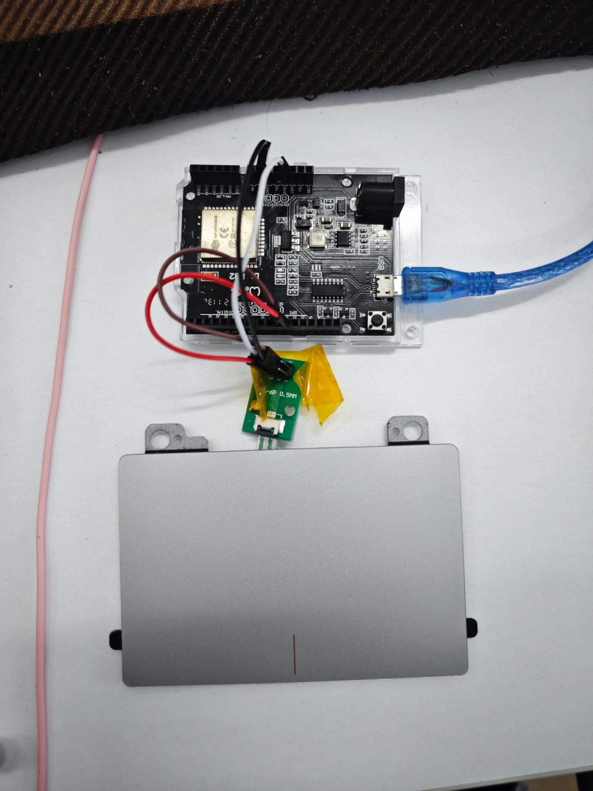

