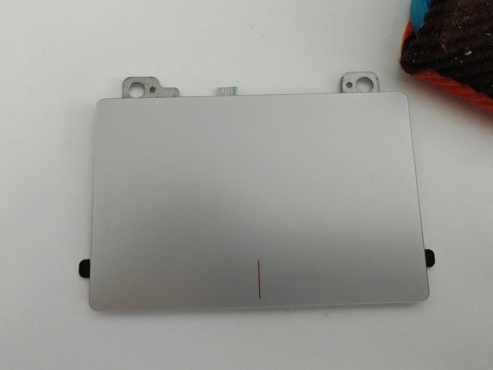
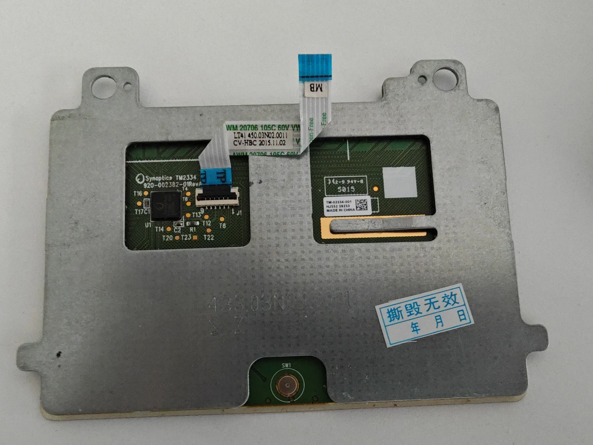
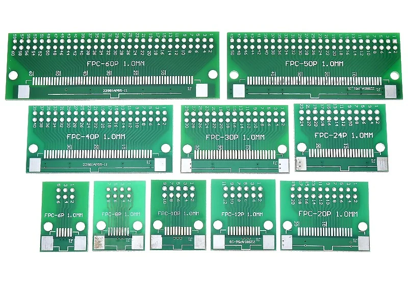
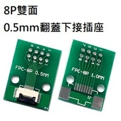
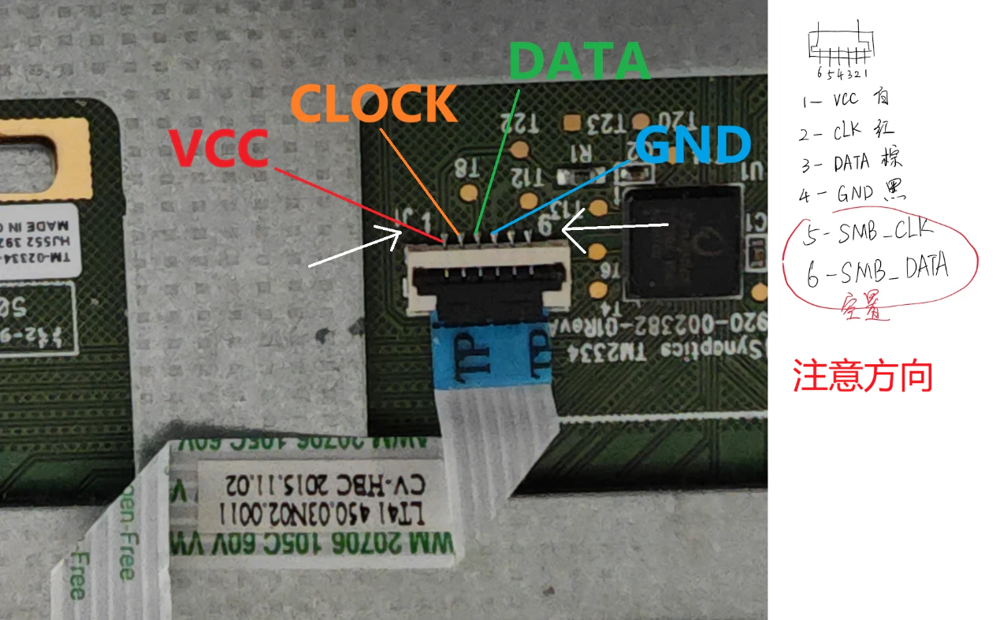
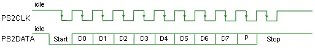
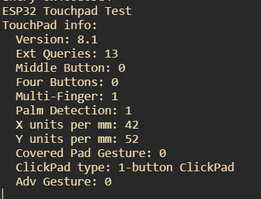
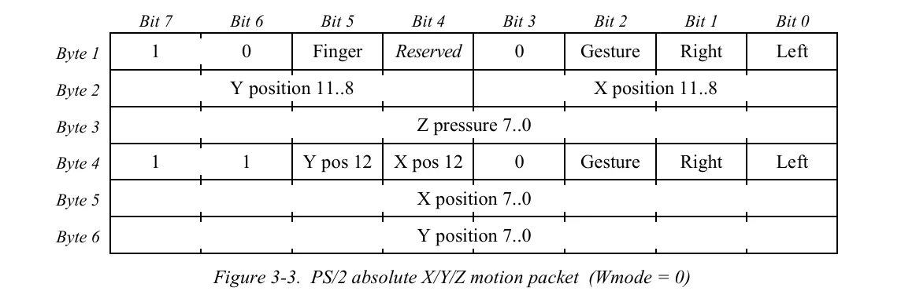
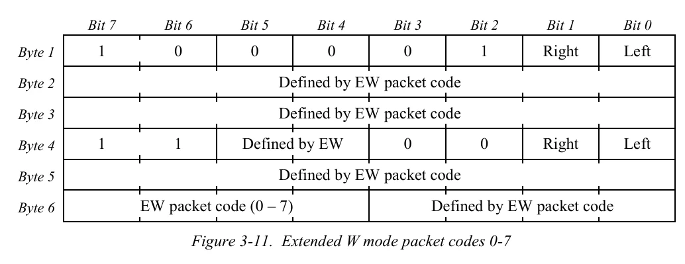
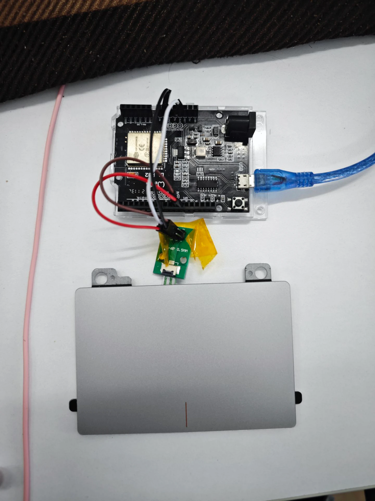

<video src="video.webm" controls="controls" height="20%"></video>

## 前言

我个人很喜欢小型化的设备，包括小键盘小鼠标小掌机~~小萝莉~~之类的。我前段时间找到了目前最小的剪刀脚键盘，很小，只有 7 寸，但是甚至有背光：

我挺喜欢这个键盘的，但是这个键盘有个缺点，就是还是太大了，虽然厚度不到 5mm，但是如图所示，前后还是留有不少的无效空间，而且如果再有个触摸板就好了。所以我就开始筹划怎么搞。由于这个键盘还能用，先不糟蹋了，买个触摸板，先搞触摸板吧。于是我打开 tb，找到了目前来说最便宜的触摸板，TM2334，算上邮费只要 16 块钱。这是用在 12、13 年联想 S41 笔记本上的触摸板，本身支持多点触控，手感也很好：

下一步就是要搞懂触摸板是怎么工作的。

## 竟然是 PS/2

拿到触摸板，由于是商用化产品，不是什么模块之类的，所以文档你是别想了，先查查这个型号有没有人搞过吧。结果一查，还真有：

https://forum.level1techs.com/t/touchpad-ps-2-pinout-help/139088

我最先查到的是这一篇帖子，上面详细的介绍了他想让这个触摸板作为一个 PS/2 设备工作，他连接了几个测试点位，但是还是无法通过纯 PS/2 方法驱动：

还有一个帖子的老哥直接给出了排线定义，也是焊接到了 PS/2 座子上，但是无法驱动：

https://www.eevblog.com/forum/projects/usb-touchpad-synaptics-tm2334/

这个老哥很执拗，坚定的认为只有能直接用 PS/2 驱动才行，而我们不太一样，我们还是想通过蓝牙来进行通信的，所以可以不受这些东西的限制。我翻出了之前毕业设计的时候白嫖的舍友的 D1 R32，这个开发板长得和 Arduino UNO 差不多，但是主控是 ESP32，双核处理器，240MHz 的频率，支持连接 WiFi 和蓝牙，性能非常强劲，拿来开发正好：

要连接触摸板，我们不用像国外老哥这么粗犷，直接买个 6 针的 FPC 连接座就行了，我第一次的时候没经验，看到有 0.5 和 1.0 的，还以为的后面孔的间距，还想着买这么宽干啥，0.5 的就行了，没想到是排线的宽度，触摸板正好还用的是 1.0 的排线，好在这个连接座正面是 0.5，反面就是 1.0，再买个 1.0 的座焊上就行了，很简单，总算是没浪费。

根据之前帖子里老哥给的定义，我们知道了排线的定义：

1.  **+3VS**: 这是 3V 电源引脚，表示为“+3 Volt Supply”。它为相关电路（如触控板）提供电源。
2.  **TP_CLK (Touchpad Clock)**: 这是触控板的时钟信号引脚。时钟信号在传输过程中用于同步数据的发送和接收。
3.  **TP_DATA (Touchpad Data)**: 这是触控板的数据传输引脚，负责传输触控板与主控器之间的数据。
4.  **GND**: 接地引脚，提供电气回路的参考点。所有电流都会回流到这个引脚。
5.  **SMB_CLK (SMBus Clock)**: 这是系统管理总线（SMBus）的时钟引脚。SMBus 用于与低带宽的设备通信，如电池或传感器。
6.  **SMB_DATA (SMBus Data)**: 这是系统管理总线的数据引脚，用于在 SMBus 设备之间传输数据。

一定要注意方向，注意看上面标出的 1 和 6。5 和 6 是电脑主板用的，我们用不到，而且大家注意，不是每个触摸板的引脚定义都是这个，如果要随便买个触摸板来改装，需要自己去网上找找资料。

## PS/2 的二三事

首先我们要先了解一些 PS/2 的基础知识，一个标准的 PS/2 座子是这样的

电源和地线不用说，**时钟线（CLK），**用于同步数据传输；根据需要由设备或主机控制。**数据线（DATA）**：在主机和设备之间传输数据位。当 PS/2 设备处于闲置状态的时候，时钟和数据引脚全部拉高。当主机想要给设备发送数据时，拉低 CLK 和 DATA，表示请求发送数据。设备到主机只需要控制 CLK 就可以发送数据了。所以我们可以把中断附加到时钟引脚，下降沿触发读取信号就可以实现对 PS/2 设备的信号读取了。

PS/2 数据帧是这样的：

- **起始位**：始终为 0（LOW）。

- **数据位**：8 位，最低有效位（LSB）先发送。

- **奇偶校验位(Parity,P)**：确保奇校验（1 的总数为奇数）。

- **停止位**：始终为 1（HIGH）。

知道了数据的读取方式，下一步就是如何初始化一个 Synaptics 触摸板了。

## Synaptics，启动！

其实，如果你只使用 PS/2 的标准协议也是能启动一个 Synaptics 触摸板的，因为本身 Synaptics 触摸板就是一个 PS/2 兼容设备：

但是恶心的是，明明 PS/2 鼠标有左键右键和滚动的功能，如果在没有驱动的情况下，Synaptics 触摸板就只能上下左右移动和使用鼠标左键，这只能说勉强能用，再多都谈不上了。至于什么双指单击是右键，双指滑动是滚轮，那你是想都别想，根本触发不了。如果要使用多指手势，必须在初始化的时候使用特殊的初始化指令。但是网上的资料非常稀少，经过我不懈的查找，还真让我找到一个完美贴合我的要求的：

https://github.com/delingren/synaptics_touchpad

这个人提交代码的时间差不多和我刚有这个想法的时间差不多，7 月份。这个人实现了一个有线的 Synaptics 触摸板单片机驱动，这下太好了：

那么我们就借着他的程序来说明一下 Synaptics 给 PS/2 加了什么料。

一个标准的 PS/2 的鼠标在 BIOS 启动过程是这样的：主机发出“获取设备 ID”命令 (0xF2) 并等待响应。如果标准 PS/2 鼠标已连接，它将传回一个 ACK（0xFA），并以设备 ID 进行响应 0x00。在这种情况下，主机将识别出鼠标确实是有滚轮并将继续将其视为标准 PS/2 鼠标。

之后，我们需要获取 Synaptics 触摸板的一系列信息以便于下一步的处理：

1. **获取版本信息**：
   1. 使用  status_request(0x00, result)  获取触摸板版本信息。
      1. infoMajor：主版本号，取  result\[2\]  的低 4 位。
      2. infoMinor：次版本号，取  result\[0\]。
2. **获取能力信息**：
   1. 使用  status_request(0x02, result)  获取触摸板的能力信息。
      1. capExtended：是否支持扩展功能，result\[0\]  的最高位。
   2. 如果支持扩展功能，解析：
      1. nExtendedQueries：扩展查询的数量。
      2. middleButton：是否支持中键，result\[0\]  的第 2 位。
      3. fourButtons：是否支持四个按键，result\[2\]  的第 3 位。
      4. multiFinger：是否支持多指，result\[2\]  的第 1 位。
      5. palmDetect：是否支持掌心检测，result\[2\]  的第 0 位。
3. **获取单位信息**：
   1. 使用  status_request(0x08, result)  获取触摸板的单位信息。
      1. units_per_mm_x：X 方向每毫米的单位数，result\[0\]。
      2. units_per_mm_y：Y 方向每毫米的单位数，result\[2\]。
4. **获取点击板信息**：
   1. 使用  status_request(0x0C, result)  获取点击板的类型信息。
   2. coveredPadGest：是否支持覆盖板手势，result\[0\]  的最高位。
   3. clickpad_type：触摸板类型，结合  result\[0\]  和  result\[1\]  的位。
   4. clickPadInfo：触摸板类型的描述数组。
   5. advGest：是否支持高级手势，result\[0\]  的第 3 位。
   6. clearPad：是否支持清除板，result\[0\]  的第 2 位。

然后就可以配置触摸板的模式了，估计作者也研究了半天怎么给触摸板设置模式，最终他也是选择了参考其他项目初始化触摸板的指令序列：

> // 参考资料： 4.3. 模式字节 
> 
> // 不知为何，我无法让触摸板报告扩展 W 模式数据包。 
> 
> // 经过研究，我在 VoodooPS2 驱动程序（用于 Hackintosh 的触摸板驱动程序）中找到了解决方案。 
> 
> // 这个序列设置了绝对模式、高速率、W 模式和 EW 模式。 
> 
> 
> // F5 
> 
> // E6, E6, E8, 03, E8, 00, E8, 01, E8, 01, F3, 14 
> 
> // E6, E6, E8, 00, E8, 00, E8, 00, E8, 03, F3, C8 
> 
> // F4

在程序中的体现是这样的：

- 两次  SETSCALE11（设置缩放比例为 1：1，0xE6）  命令。
- 发送特殊命令  0xC5。
- 设置采样率为  0x14。
- 再次发送两次  SETSCALE11  命令。
- 发送特殊命令  0x03。
- 设置采样率为  0xC8。

虽然看不太懂，但是确实实现了触摸板的正常使用。具体可以参考 Synaptics 触摸板的文档：https://github.com/delingren/synaptics_touchpad/blob/main/touchpad_RevB.pdf，但是我浅读了一下，并没有找到对应的方式。

关于 W 模式，文档里是这么说的：

1.  **当 Wmode 位被设置为 1 时**：
    - 触摸板**不报告手势信息**。
    - 此时，位 2 自动用于报告  **EWmode（Extended W mode，扩展 W 模式）**。
    - EWmode 提供了扩展的 W 模式功能，在 EW 模式下，传统的 X、Y、Z 数据不再具有之前的含义，而是根据 EW 模式的数据包代码重新定义。
2.  **当 Wmode 位被设置为 0 时**：
    - 触摸板**报告手势信息**。
    - 此时，位 2 表示  **DisGest（Disable Gesture，禁用手势）**。
    - 如果 DisGest 位为 0，表示**启用点击和滑动手势处理**。
    - 如果 DisGest 位为 1，表示**禁用点击和滑动手势检测**。
    - 当 DisGest 位为 1 时，在相对模式下，鼠标数据包将报告真实的物理按键状态，而在绝对模式下，数据包的 Gesture 位始终为 0（即不报告手势）。

初始化完成后，我们只需要根据 PS/2 设备的信息读取方式对触摸板发送的信息进行处理就行了。触摸板作为一个 PS/2 设备，通过时钟线和数据线与主机进行通信。当触摸板需要发送数据时，会通过时钟线发送同步信号，我们只需要在时钟线的下降沿读取数据线的状态，就能获取到完整的数据包。每个数据包包含 48 位数据，这些数据记录了触摸板上手指的位置、压力、宽度等信息。传回的数据包主要有两种：

- **主要数据包（Primary Packet）**：用于传输基本的触摸信息，如手指数量、坐标、压力等。
  - **第 1 字节（位 47-40）**：
    - 位 47：同步位，一般为 1
    - 位 46-44：手指数或其他标志位
    - 位 43-40：可能用于按键状态、触摸类型等
  - **第 2 字节（位 39-32）**：
    - Z 值，高 8 位，表示压力
  - **第 3、4 字节（位 31-16）**：
    - X 坐标，高 16 位
  - **第 5、6 字节（位 15-0）**：
    - Y 坐标，高 16 位

- **扩展数据包（Extended Packet）**：用于传输更多的细节信息，支持多手指操作、特殊手势等。
  - **第 1 字节（位 47-40）**：
    - 特定的标志位，用于区分扩展数据包类型
  - **第 2 字节（位 39-32）**：
    - 扩展信息，如功能代码、手指数等
  - **剩余字节**：
    - 根据扩展数据包的类型，包含不同的内容，如额外的坐标、手势信息等

对于是主要数据包还是扩展数据包，可以看上面说的，检测 w 是 0 还是 1，具体要看 2，4，5，和第 26 位。

## 蓝牙化

其实蓝牙化特别简单，直接使用 https://github.com/T-vK/ESP32-BLE-Mouse 这个库就可以了。

由于 ESP32 是双核处理器，处理触摸板信息的部分我放在了 0 核上，而通过蓝牙发送信息则是默认在 1 核上运行。我主要使用了 ESP32 自带的  FreeRTOS 中的多任务机制，以实现以下目的：

- **数据处理与任务分离**：将触摸板的数据接收和数据处理分离到不同的任务中，提升系统的响应速度和稳定性。
- **异步处理**：通过任务和队列，实现数据的异步传递，避免在中断中进行繁重的处理。

由于触摸板通过中断的方式将数据发送给 ESP32。中断服务程序  byte_received  接收到数据后，需要将数据传递给任务进行处理。由于一次只能接收一个字节，需要将连续接收的 6 个字节拼接成一个完整的数据包。当接收到完整的数据包后，使用 xQueueSendFromISR 将数据包发送到 mouseEventQueue 队列中。

之后在处理程序中，使用 xQueueReceive 从队列中接收数据包，超时时间为 10 毫秒。根据数据包内容，判断其类型，并调用相应的解析函数。如果蓝牙已经连接，则将鼠标事件通过 蓝牙发送出去。这样就实现了数据的蓝牙化。

## 实现复杂手势以及优化

### 关于数据包

根据要求连接触摸板后，每当触摸时触摸板会向主机发送 6 字节的数据包。这些数据包包含手指位置、压力（此触摸板的压力值报告的是触摸面积）、宽度等信息。TM2334 这款触摸板最大只能检测出 3 个手指，所以超过三指的手势无法

由于通信不可避免地会出现噪声，数据包可能会丢失或被更改。并且捕捉每一个数据帧并不是非常关键，丢个一两帧问题也不大。同时一些数据包具有独特的特征（例如，某些位置的固定位），可以用作同步和恢复数据包。因此，如果接收到意外的数据包，我会继续丢弃数据包，直到重新同步。简单说就是校验数据包的第 0 和第 24 个字节，确保第 0 个字节的第 7 位为 1，第 6 位和第 3 位为 0；确保第 24 个字节的第 7 位和第 6 位为 1，第 3 位为 0。具体为什么，我是从 VooDooPS2 驱动中抄的，为什么并不是很清楚，我也不是很想仔细读文档找到为什么，大概知道有这么回事就行了。

### 想要实现的功能

**我主要想实现下面的功能，其实下面的功能实现之后，日常用就一点问题没有了：**

- 鼠标移动
- 按动左下角的区域作为鼠标左键，按动右下角的区域作为鼠标右键（封壳之后再实现，目前按起来比较困难）
- 轻触作为点击
  - 单指轻触作为鼠标左键
  - 两指轻触作为鼠标右键
  - 三指轻触作为鼠标中键
  - 屏蔽手掌误触
- 滚动
  - 两指上下滑动来作为垂直方向的滚动
  - 两指左右滑动来作为水平方向的滚动
- 三指手势
  - 三指左右移动来切换应用
  - 三指上下移动来显示桌面或回到应用
- 轻触一下，然后移动手指来实现拖拽
- 放大和缩小
- 休眠模式

**其中三指手势并不是 HID 设备原生支持的，可能要参考微软的文档（切换应用估计到时候用键盘发送 Alt + Tap，然后再发上下左右实现；显示桌面和），这个再说，主要说说其他的功能。**

## 实际实现

如果我们在每一帧中忠实地报告手指位置，光标会因为人类手指固有的噪声和不稳定性而出现很多抖动。为了解决这个问题，可以通过下面的一些优化方案来实现：

- **平均化**：我不在每一帧中报告手指的位置，而是跟踪最近 n 帧的平均值，以消除突发的移动，目前我设置的是 20 帧，这个值越低精度越高，光标也有可能越抖。
- **噪声阈值**：如果两帧之间的增量低于某个阈值，则认为是误触。这个数值是经验性的，需要通过多次实验来找到，而且触摸板不同，使用的值也不太一样，目前我设置的值是 0.08mm。
- **通过阈值把手粘住**：当手指保持静止时，我们使用更高的阈值，使其在开始时更“粘”，但在移动时更平滑。

对于滚动，由于 HID 协议报告的时候使用的是整数，即使轻轻划一下也只能报告 1，而不能报告小数，所以需要通过一种方式实现快速和精准的滚动，其实很简单：当手指移动缓慢且幅度较小时，我只在每几帧中生成一个报告，移动量为 1。一旦速度超过某个阈值，我就假设用户的意图是快速滚动大范围。在这种情况下，我会在每一帧中报告，且移动量与实际移动成正比。

对于轻触作为点击，实现逻辑是这样的：当检测到手指刚刚按下时（上一帧手指个数为 0，当前帧手指个数不为 0），记录按下的帧号以及按下了几个手指，因为有可能触摸板反应速度太快而导致实际按下了三个手指，但是刚开始的时候只识别到了一个，所以在后面的处理中需要记录按下手指的最高数量。最后，当手指移开的时候（上一帧手指个数不为 0，当前帧手指个数为 0），检查在这个过程中手指的移动距离、按动时间、接触的宽度是不是小于一个阈值，如果都满足才触发。这样就可以避免异物或者手掌误触到触摸板导致误触发。

轻触之后移动作为拖动这个功能也不难，其实就是单指点击之后在一个阈值内滑动就是拖动。只不过要注意这个应该是先通过左键按下，然后移动光标，最后左键松开来实现的。

**目前基本已经可以作为正常的日常使用了，也就是说，只要 16 块钱买个触摸板，20 块钱买片 ESP32，加上外围电路不超过 50 就能实现低成本的蓝牙触摸板。**

