Previously, we discussed some aspects of H.264 encoding in MP4. This time, let's delve into how H.264 achieves such high compression rates, which brings us to the concepts of intra prediction and inter prediction. After some research, I found that there might not be any other source as detailed as this one, and it contains almost no complex or difficult information—reading this is a gain! (\*/ω＼\*)

## Intra Prediction

Intra prediction is an important concept in video encoding, where predictions are formed from already encoded frames. In video compression, three types of frames are typically used: I-frames, P-frames, and B-frames. I-frames are key frames that use only intra prediction. P-frames and B-frames may use either intra prediction or inter prediction depending on the situation.

Intra prediction is the process of forming predictions from the encoded parts of the current frame. This can be viewed as a precise form of self-encoding. First, the type of frame needs to be determined. If it is an I-frame, it uses only intra prediction. If it is a P-frame or B-frame, it will choose a prediction method for each macroblock based on the costs of intra and inter prediction. This process encodes data for a frame (or less than a full frame). The data referenced during encoding is this frame, meaning that decoding only requires this frame's data. This encoding method is also used in image encoding; for example, the encoding method for webp images is extremely similar to H.264's intra encoding method.

The prediction process works as follows: first, the original data is subtracted from the predicted value to obtain the residual data. Then, the residual data undergoes discrete cosine transform (DCT) and quantization. During the encoding phase, a zigzag scan is performed, and predictions are used to reduce the size of some header information. The results of the DCT and quantization are also subjected to inverse calculations. Finally, the predicted value and the result of the inverse calculation are added together, completing the precise self-encoding.

Intra prediction uses limited data for the next intra prediction. Before being added to the reference list and used for inter prediction, a loop filter is applied to reduce block effect distortion. This is the basic concept and process of intra prediction.

### The Significance of Residuals

In video encoding, residual data represents the difference between the original data and the predicted data. This concept comes from predictive models, where the predicted value is often not entirely accurate, resulting in some "residuals" or errors.

When encoding video frames, we typically attempt to predict the value of each pixel and then calculate the difference between the predicted value and the actual value, which is the residual. The advantage of this approach is that residual data usually contains more zero values than the original pixel data, making it easier to compress and encode.

For example, if we predict a pixel's value to be 200, but the actual value is 205, the residual is 5. When encoding this residual value, we only need to store this small difference instead of the complete pixel value. This significantly reduces the amount of information that needs to be stored, achieving data compression.

In video encoding, we often further process the residual data, such as applying discrete cosine transform (DCT) and quantization, before encoding. These steps are all aimed at further compressing the data, reducing the required storage space and bandwidth. Below are the original image and a visual representation of the image after calculating the residuals.

So why do residuals occur? It is due to inaccuracies in prediction. Let's take a look at how predictions are actually made.

### Prediction Modes

In H.264, images are represented using YUV, where "Y" represents luminance, and "U" and "V" represent chrominance, which is different from the typical RGB and HSV formats.

In intra prediction mode, the prediction block P is generated based on previously encoded and reconstructed blocks and is subtracted from the current block before encoding it. For luminance samples, each 4×4 block or 16×16 macroblock forms a prediction block P. Each 4×4 luminance block has nine selectable prediction modes, while each 16×16 luminance block has four modes, and the chrominance components also have four modes. The encoder typically selects the prediction mode that minimizes the difference between the prediction block P and the block to be encoded.

There is also a special encoding mode called I PCM, which is a unique intra encoding mode that allows the encoder to directly transmit the values of image samples without the need for prediction or transformation. In certain special cases (such as unusual image content and/or very low quantization parameters), this mode can be more efficient than the usual processes of intra prediction, transformation, quantization, and entropy coding. Including the I PCM option allows for absolute limits on the number of bits that may be contained in the encoded macroblocks without compromising the quality of the decoded image.

### Luminance

For luminance, there are 9 prediction modes:

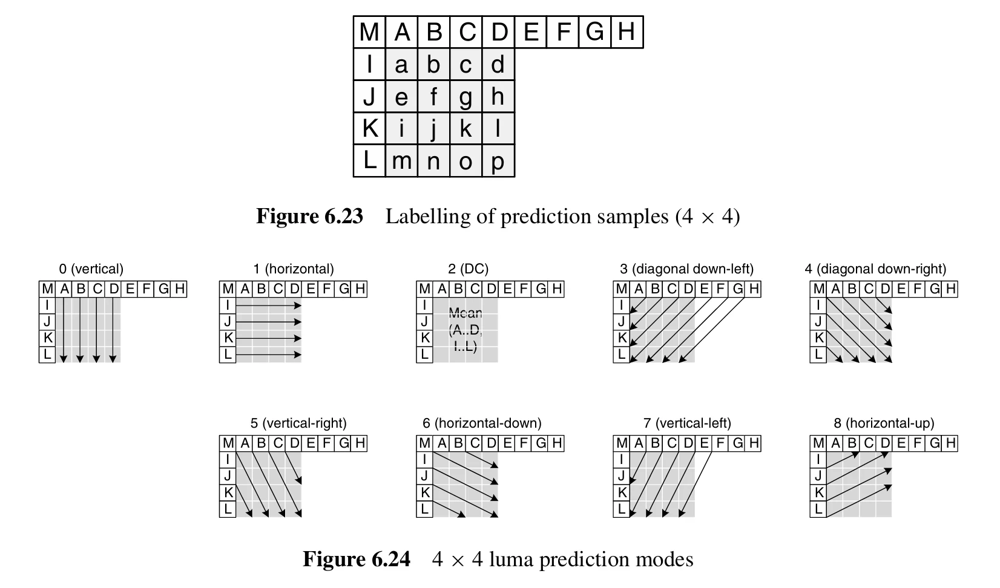

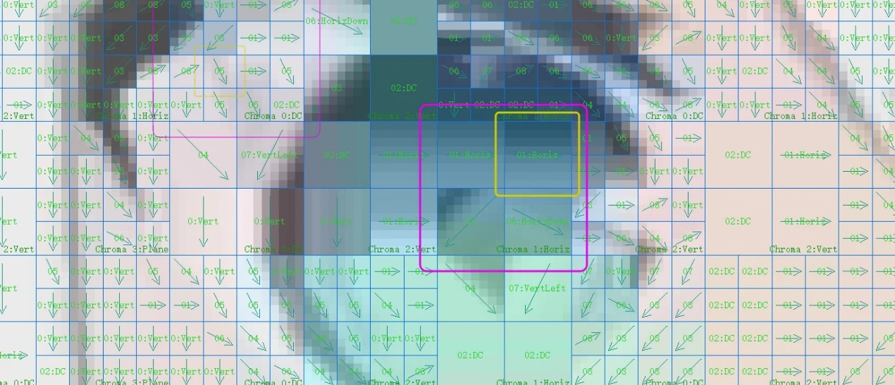

We can consider that for a macroblock, the luminance can fit into one of the above 9 modes based on the pixels to the left and above it. The images clearly show that almost every block fits one of these 9 modes. However, the drawback is that this prediction can lead to distortion. We can observe the differences between the actual image and the predicted image:

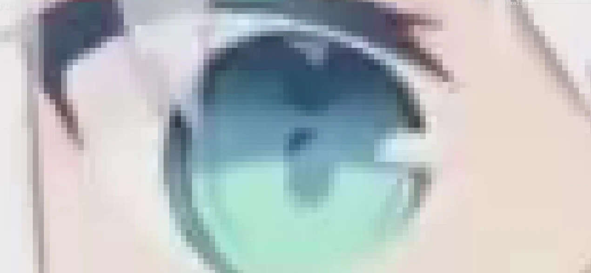 Original Image

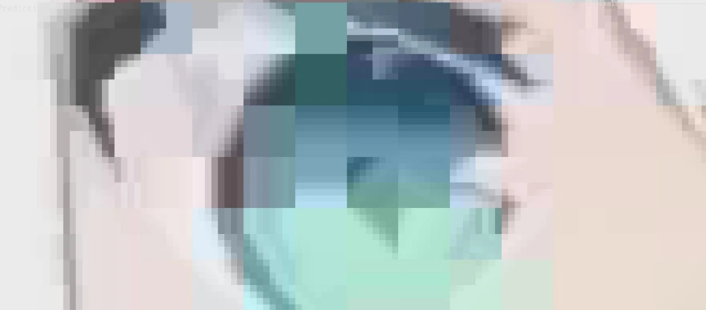 Predicted Image

The differences between the two are quite evident, which necessitates storing residual information to compensate for the discrepancies with the actual image.

For larger blocks, larger prediction methods such as 8x8 or 16x16 can be used, and in practice, the results are not significantly different. Generally, H.264/AVC supports prediction on 16x16 and 4x4 blocks. These two prediction modes are referred to as macroblock prediction (16x16) and subblock prediction (4x4).

However, H.264/AVC also supports 8x8 transforms. This is an optional feature that can be used as an alternative to the default 4x4 transform. In certain cases, using the 8x8 transform can provide better encoding efficiency. For macroblock prediction, there are only 4 modes, while the 8x8 transform, being an alternative to subblock prediction, has 9 modes.

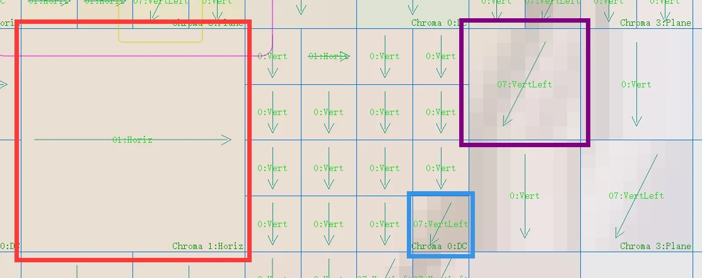
Red indicates 16x16, purple indicates 8x8, and blue indicates 4x4.

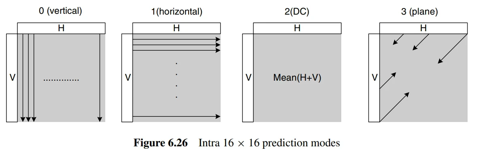
The 4 modes for 16x16.

### Chrominance

For chrominance, there are 4 modes, and the situation is similar to the 16x16 modes for luminance, so the images are the same.

In H.264/AVC encoding, chrominance prediction is typically performed on 8x8 blocks. This is because, in many cases, the sampling rate of the chrominance signal is lower than that of the luminance signal, a phenomenon known as chroma subsampling. For example, in the common 4:2:0 subsampling mode, every four luminance samples correspond to one chrominance sample. Therefore, a 16x16 luminance block corresponds to an 8x8 chrominance block.

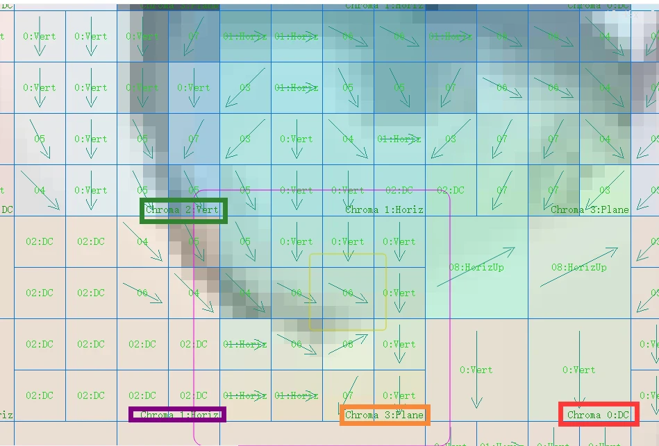

In stream analysis software, the 16x16 chrominance block is actually a visual representation of the original video. In the 4:2:0 chroma subsampling mode, a 16x16 luminance macroblock corresponds to an 8x8 chrominance block. However, for visualization purposes in stream analysis software, these 8x8 chrominance blocks may be enlarged to 16x16 to match the size of the luminance macroblocks. This is done for easier display and comparison of luminance and chrominance data. This is merely a visualization method; the actual chrominance data is still predicted and encoded in 8x8 blocks. This is because, in the 4:2:0 chroma subsampling mode, the resolution of the chrominance signal is half that of the luminance signal.

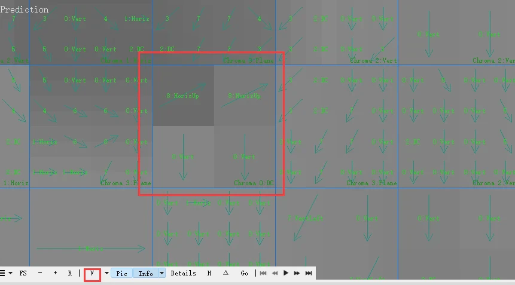

Switching to chrominance mode, we can clearly see the 8x8 patterns.

As for which mode the encoder should choose, this is determined based on the SAE.

### SAE

SAE stands for "Sum of Absolute Errors." It is a common error measurement used to evaluate the effectiveness of prediction or encoding operations.

In video encoding, we typically need to predict the original video data to reduce the amount of data that needs to be encoded and transmitted. For example, we might predict the pixel values of a block and then only encode the difference between the predicted values and the actual values (known as prediction error or **residuals**). This significantly reduces the amount of data that needs to be encoded, thereby improving encoding efficiency.

SAE is a metric used to assess the effectiveness of this prediction. It is the sum of the absolute values of the prediction errors. If the SAE value is small, it indicates that the prediction is effective, as the prediction error is small. Conversely, if the SAE value is large, it indicates that the prediction is less effective.

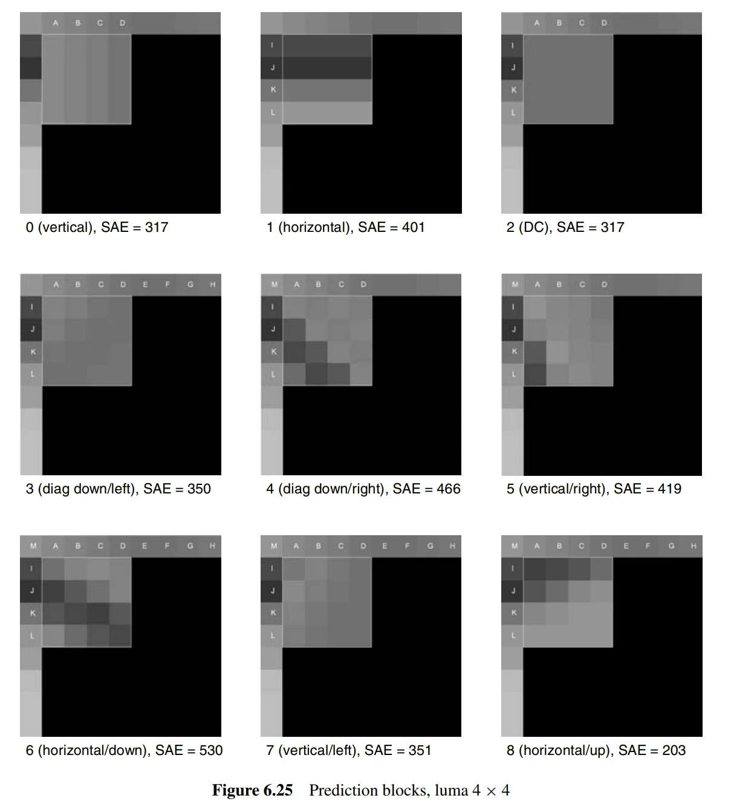

The SAE of 8 is the lowest, so the encoder will choose 8.

The specific calculations are not particularly important; they can be quite complex and are not necessary for someone who is not involved in encoder development.

## Inter Prediction

Inter prediction is a method that utilizes the temporal correlation between video frames to reduce redundancy. In this approach, the encoder creates a prediction model from one or more previously encoded frames (or fields) and then uses this model to predict the content of the current frame. The difference between the predicted result and the actual content (known as prediction error or residual) will be encoded and transmitted.

Inter prediction primarily relies on motion compensation. Motion compensation is a method for estimating and compensating for motion between video frames. In this method, the encoder finds a motion vector for each block or sub-block, which indicates the corresponding position of that block in the previous frame. The encoder then uses the content from that position to predict the content of the current block.

### Tree Structure Motion Compensation

Tree structure motion compensation is a flexible method of motion compensation. In this approach, each macroblock (16x16 luminance samples) can be split in various ways, such as one 16x16 macroblock, two 16x8 blocks, two 8x16 blocks, or four 8x8 blocks. If the 8x8 mode is chosen, each 8x8 sub-macroblock can be further split into one 8x8 sub-macroblock, two 8x4 sub-macroblocks, two 4x8 sub-macroblocks, or four 4x4 sub-macroblocks. This splitting method provides a large number of combination possibilities for each macroblock.

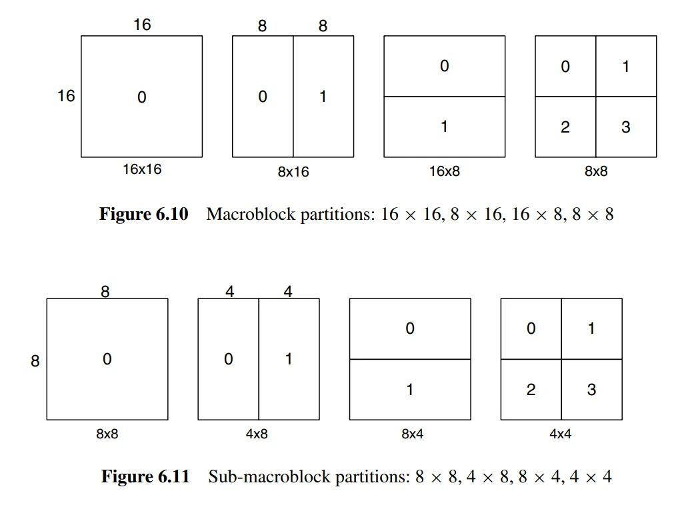

Each split or sub-macroblock requires a separate motion vector. This motion vector must be encoded and transmitted, and the choice of split must also be encoded into the compressed bitstream. Therefore, the choice of split size has a significant impact on compression performance. Generally, for uniform areas of a frame, a larger split size is more appropriate, while for detailed areas, a smaller split size may be more beneficial.

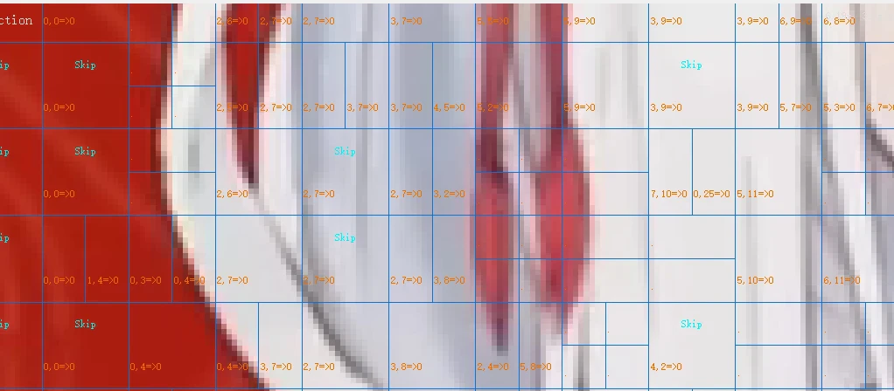

The resolution of the chrominance components (Cb and Cr) in a macroblock is half that of the luminance component. The splitting method for each chrominance block is the same as for the luminance component, but the horizontal and vertical resolutions of the split sizes are exactly half that of the luminance component. For example, an 8x16 luminance split corresponds to a 4x8 chrominance split; an 8x4 luminance split corresponds to a 4x2 chrominance split, and so on. The horizontal and vertical components of each motion vector are halved when applied to the chrominance blocks, as previously mentioned.

In the actual encoding process, the encoder will choose the optimal split size. For example, in areas of the frame with little variation (where the residual appears gray), a 16x16 split may be chosen; whereas in areas with significant motion (where the residual appears black or white), smaller splits may be more effective.

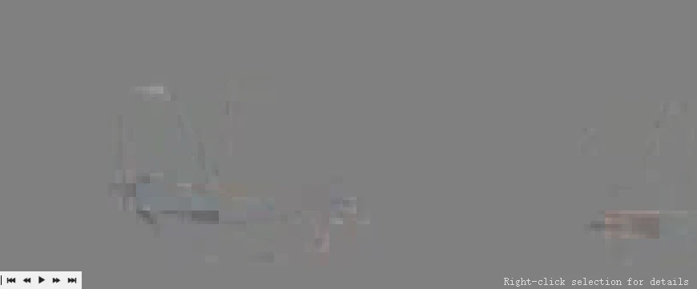

### Motion Compensation Interpolation

In motion compensation, we need to find a region of the same size as the current block from the reference frame for prediction. The position of this region is determined by the motion vector, which has a quarter-pixel precision for the luminance component and an eighth-pixel precision for the chrominance component. However, such precision samples do not exist in the reference frame, so interpolation is required to generate these samples. In simple terms, motion compensation is achieved through motion vectors, which describe the positional offset between the region in the reference frame and the current block. However, this **offset may be a fraction**, meaning that the block we need to predict may lie between the pixels of the reference frame. In this case, we need to use interpolation methods to generate these non-existent pixels.

The interpolation process is as follows:

1. First, generate half-pixel samples located between integer position samples in the luminance component. These samples are obtained through interpolation using a finite impulse response (FIR) filter with weights of (1/32, -5/32, 5/8, 5/8, -5/32, 1/32). For example, the half-pixel sample b is calculated from the six horizontal integer samples E, F, G, H, I, and J.

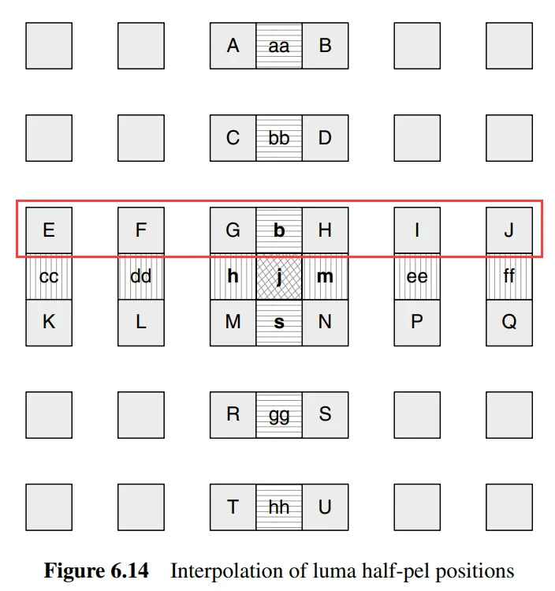

2. Once all half-pixel samples adjacent to the integer samples are calculated, the remaining half-pixel position samples can be generated through interpolation.
3. After all half-pixel samples are generated, quarter-pixel position samples can be created through linear interpolation.

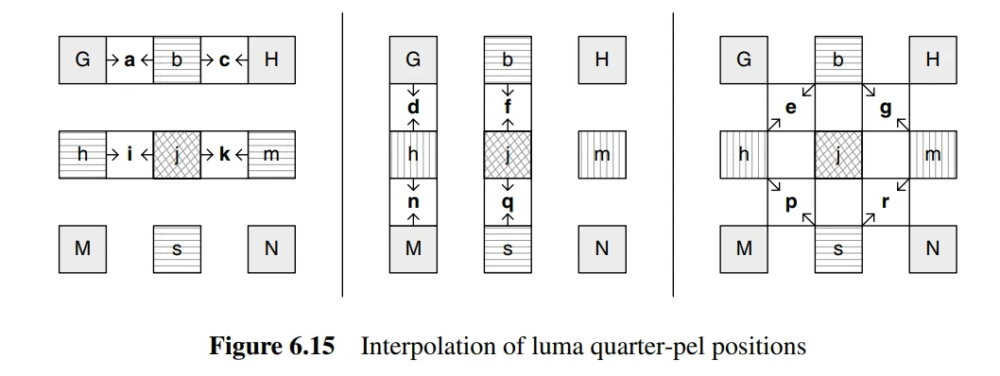



1. For the chrominance component, since the sampling rate is 4:2:0, it is necessary to generate interpolation samples at eighth-pixel intervals. These samples are obtained through linear interpolation, where each sub-sample position \\( a \\) is a linear combination of the four adjacent integer sample positions \\( A, B, C, \\) and \\( D \\).

### Motion Vector Calculation

In video encoding, the primary role of the motion vector (MV) is to perform motion compensation prediction. This is a technique that utilizes the temporal correlation between frames in a video sequence to reduce redundancy.

Specifically, when encoding a macroblock (MB) or partition in a frame, we can find a similar macroblock or partition in a previous or subsequent frame as a reference, and then calculate the motion vector between these two macroblocks or partitions. This motion vector indicates the positional movement of the current macroblock or partition relative to the reference macroblock or partition.

In video encoding, encoding a motion vector for each partition can consume a significant number of bits, especially when smaller partition sizes are chosen. Since the motion vectors of adjacent partitions are often highly correlated, each motion vector is predicted based on the vectors of nearby encoded partitions. First, a predicted vector \\( MV_p \\) is formed based on previously calculated motion vectors, and then the difference between the current vector and the predicted vector (Motion Vector Difference, MVD) is encoded and transmitted.

The formation of the predicted vector \\( MV_p \\) depends on the size of the motion compensation partition and the availability of nearby vectors. Let’s assume \\( E \\) is the current macroblock, macroblock partition, or sub-macroblock partition; \\( A \\) is the partition or sub-partition to the left of \\( E \\); \\( B \\) is the partition or sub-partition above \\( E \\); and \\( C \\) is the partition or sub-macroblock partition to the upper right of \\( E \\). If there are multiple partitions to the left of \\( E \\), the topmost one is chosen as \\( A \\). If there are multiple partitions above \\( E \\), the leftmost one is chosen as \\( B \\).

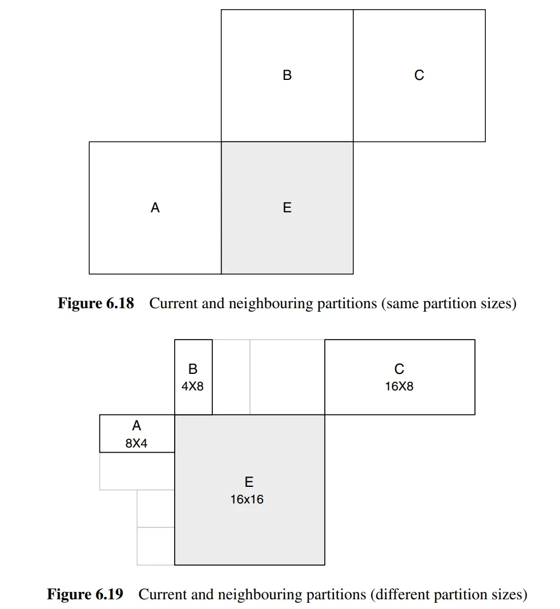

The rules for predicting and encoding motion vectors are as follows:

1. For all transmission partitions except for 16×8 and 8×16 partition sizes, the predicted vector \\( MV_p \\) is the median of the motion vectors of partitions \\( A, B, \\) and \\( C \\).

2. For a 16×8 partition, the predicted vector \\( MV_p \\) for the upper 16×8 partition is based on \\( B \\), while the predicted vector \\( MV_p \\) for the lower 16×8 partition is based on \\( A \\).

3. For an 8×16 partition, the predicted vector \\( MV_p \\) for the left 8×16 partition is based on \\( A \\), while the predicted vector \\( MV_p \\) for the right 8×16 partition is based on \\( C \\).

4. For skipped macroblocks, a 16×16 predicted vector \\( MV_p \\) is generated, similar to the case described in point 1 (i.e., as if the block were encoded in 16×16 Inter mode).

If one or more previously transmitted blocks shown in Figure 6.19 are unavailable (for example, if they are outside the current slice), the selection of the predicted vector \\( MV_p \\) is modified accordingly. In the decoder, the predicted vector \\( MV_p \\) is formed in the same way and added to the decoded vector difference \\( MVD \\). In the case of skipped macroblocks, where there is no decoded vector difference, the predicted vector \\( MV_p \\) is used as the motion vector to generate the motion-compensated macroblock.

“2,6” represents the motion vector, indicating the relative position of a macroblock in the reference frame. For example, “2,6” means that this macroblock has moved 2 pixels to the right and 6 pixels down relative to the reference frame.

The "=&gt;" followed by "0" indicates the index of the reference frame. In this example, the reference frame index is 0, meaning that the reference frame is the previous frame of the current frame.

In video encoding, to save bits, we typically do not directly encode the motion vector but instead encode the difference between the motion vector and the predicted vector (MVD). Since the motion vectors of adjacent macroblocks are usually highly correlated, this difference is often small, requiring fewer bits.

The motion vector is used for motion compensation prediction, representing the relative positional movement of a macroblock or partition in the reference frame. However, even if the motion vector is completely accurate, it does not guarantee that all pixels will match perfectly. This is because, in a video sequence, in addition to object motion, there may also be changes in lighting, variations in object shape, and other factors that can lead to discrepancies, resulting in some pixel errors even when motion compensation prediction is entirely accurate.

These errors need to be corrected through the prediction error (residual). The prediction error is the difference between the original macroblock and the motion-compensated predicted macroblock, reflecting the parts that motion compensation prediction cannot account for. The prediction error must undergo transform coding and is then sent along with the motion vector to facilitate decoding and reconstruction at the decoder end.


**References**: The content of this article primarily references the H.264/AVC standard documentation and other related materials, such as "H.264 and MPEG-4 Video Compression Video Coding for Next Generation Multimedia." The program used in this article is VQ Analyser.


