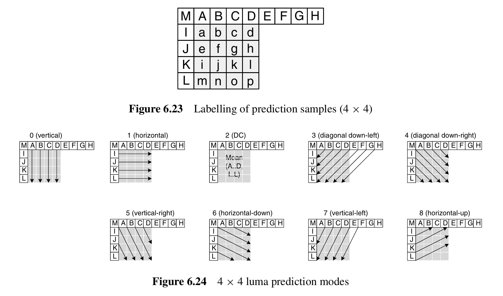
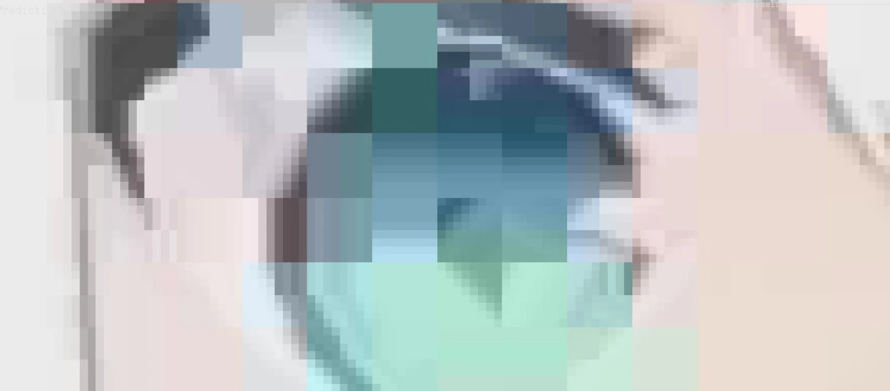
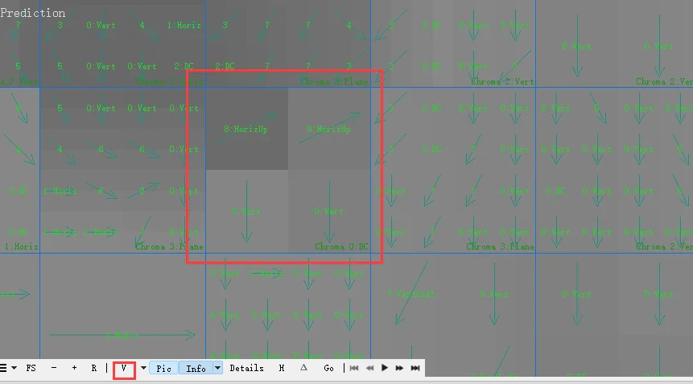
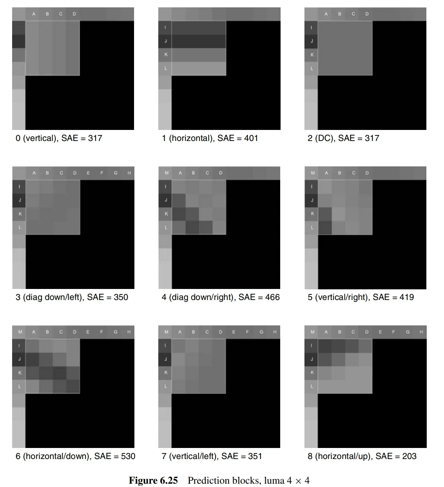
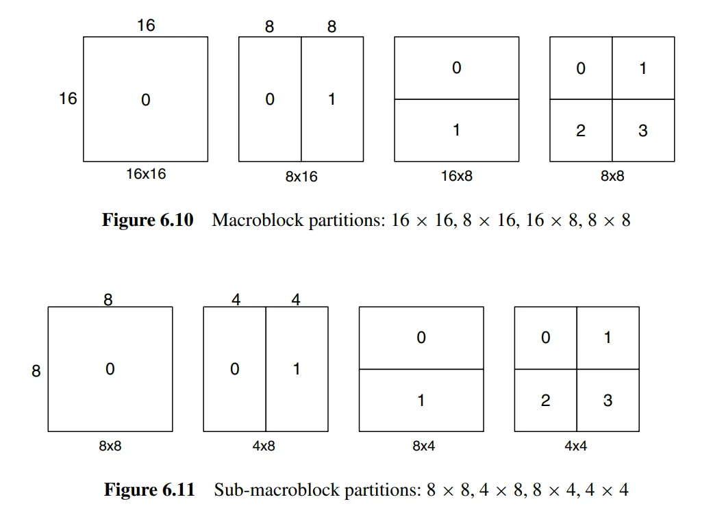
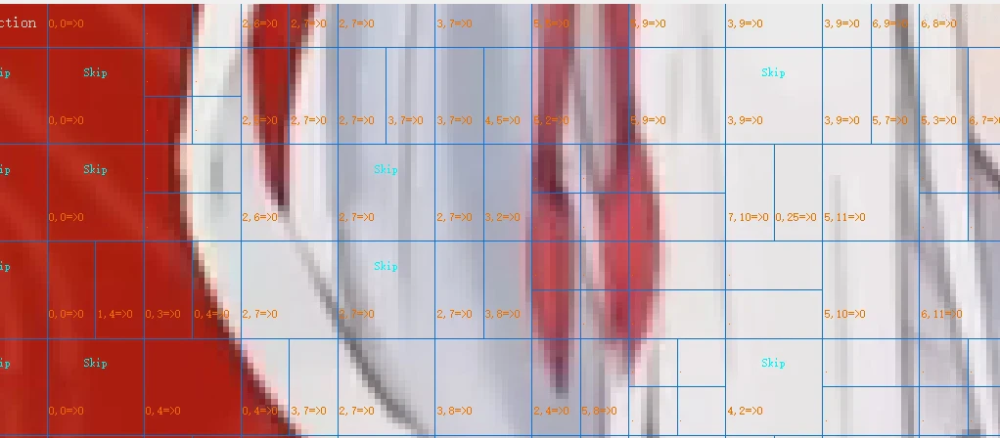
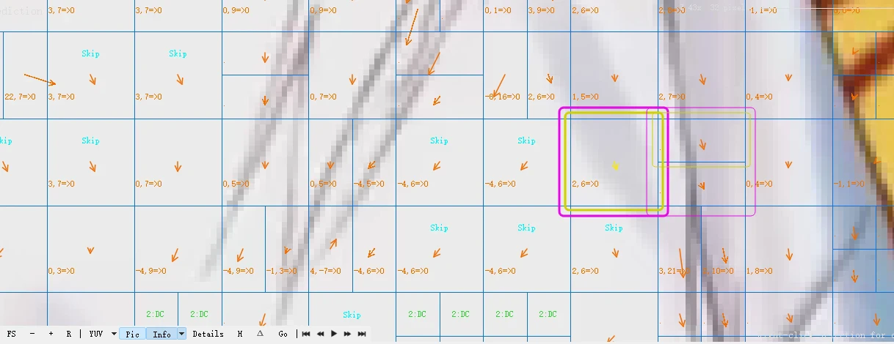

上回说了一些关于 MP4 的 H264 编码的内容，这次再来说说 H264 是如何实现这么高的压缩率的，这就不得不提到帧内编码和帧间编码，查了一下，全网可能没有我讲的这么详细的的了，而且几乎不包含任何复杂难懂的信息，读到就是赚到(\*/ω＼\*)

## 帧内预测（intra-prediction）

帧内预测（Intra-prediction）是视频编码中的一个重要概念，它是从已编码的帧中形成预测的。在视频压缩编码中，通常使用三种类型的帧：I 帧、P 帧和 B 帧。I 帧是关键帧，它只使用帧内预测。P 帧和 B 帧则会根据情况使用帧内预测或帧间预测。

帧内预测是从当前帧的已编码部分形成预测的。这个过程可以被视为一种精确的自我编码。首先，需要决定帧的类型。如果是 I 帧，它只使用帧内预测。如果是 P 帧或 B 帧，它会根据帧内预测和帧间预测的成本为每个宏块选择一种预测方式。其针对一帧（或者不满一帧）的数据，进行编码。编码时所参考的数据就是这一帧，换言之，解码也就只需要这一帧数据。这种编码方式也被用于图片的编码中，例如，webp 图片的编码方式就和 H.264 的帧内编码方式极度相似。

预测的过程是这样的：首先，将原始数据减去预测值，得到的就是残差数据。然后，对残差数据进行离散余弦变换（DCT）和量化。在编码部分，会进行 zigzag 扫描，并使用预测来减小一些头信息的大小。对于 DCT 和量化的结果，还会进行反向计算。然后，将预测值和反向计算的结果加在一起，这就完成了精确的自我编码。

帧内预测使用受限的数据进行下一次的帧内预测。在添加到参考列表并被帧间预测使用之前，会使用环路滤波器来减少块效应失真。这就是帧内预测的基本概念和过程。

### 残差的意义

在视频编码中，残差数据是原始数据和预测数据之间的差异。这个概念来自于预测模型，其中预测值通常不会完全准确，因此会有一些“残差”或者说是误差。

在我们对视频帧进行编码时，我们通常会尝试预测每个像素的值，然后计算出预测值和实际值之间的差异，这就是残差。这样做的好处是，残差数据通常会比原始像素数据有更多的零值，这使得它们更容易被压缩和编码。

例如，如果我们预测一个像素的值为 200，而实际值为 205，那么残差就是 5。在编码这个残差值时，我们只需要存储这个小的差异，而不是完整的像素值。这大大减少了需要存储的信息量，从而实现了数据的压缩。

在视频编码中，我们通常会对残差数据进行进一步的处理，比如离散余弦变换（DCT）和量化，然后再进行编码。这些步骤都是为了进一步压缩数据，减少所需的存储空间和带宽。下面是原始的图像和计算残差后可视化的图像。

那为什么会出现残差呢，是因为预测的不准，我们来看下实际是如何预测的。

### 预测模式

在 H264 中，图像通过 YUV 表示，“Y”表示明亮度（Luminance、Luma），“U”和“V”则是色度、浓度（Chrominance、Chroma），和一般的 RGB 和 HSV 不太一样。

在帧内预测模式下，预测块 P 是基于先前编码和重构的块生成的，并在编码当前块之前从当前块中减去。对于亮度（luma）样本，每个 4×4 块或 16×16 宏块都会形成一个预测块 P。每个 4×4 亮度块有九种可选的预测模式，每个 16×16 亮度块有四种模式，色度（chroma）组件也有四种模式。编码器通常会选择使预测块 P 和待编码块之间的差异最小的预测模式。

还有一种特殊的编码方式 I PCM，I PCM 是一种特殊的帧内编码模式，它允许编码器直接传输图像样本的值（无需预测或转换）。在一些特殊情况下（例如，异常的图像内容和/或非常低的量化参数），这种模式可能比通常的帧内预测、变换、量化和熵编码过程更有效率。包括 I PCM 选项可以在不限制解码图像质量的情况下，对编码宏块中可能包含的位数设置绝对限制。

### 亮度

对于亮度，有以下 9 种预测模式

我们可以认为，对于一个宏块，其中的亮度通过左和上的像素是可以拟合 成以上 9 种模式中的一种，图片中可以很清晰的看到基本上每一个块都拟合了上面 9 种模式中的一种。但是缺陷是什么呢，就是这种预测之后会失真。可以看实际图和预测图中的区别：

原始图

预测后的图

可以很清晰的看出两者的区别，这样就需要通过存储残差信息来弥补和实际图中的差别

对于更大的块，可以用更大的 8x8 或者 16x16 的预测方法，实际上差不太多。一般来说，H.264/AVC 支持在 16x16 和 4x4 的块上进行预测。这两种预测模式被称为宏块预测（16x16）和子块预测（4x4）。

然而，H.264/AVC 还支持 8x8 变换。这是一种可选的特性，可用于替代默认的 4x4 变换。在某些情况下，使用 8x8 变换可以提供更好的编码效率。对于宏块预测，只有 4 种方式，而由于 8x8 变换是子块预测的替代，所以 8x8 变换也有 9 种。

红色是 16x16，紫色是 8x8，蓝色是 4x4

16x16 的 4 种模式

### 色度

对于色度，有 4 种模式，实际的情况和亮度的 16x16 的 4 种模式是一样的，所以图也是一样的

在 H.264/AVC 编码中，色度(chroma)的预测通常在 8x8 的块上进行。这是因为在许多情况下，色度信号的采样率比亮度信号的采样率低，这被称为色度子采样(chroma subsampling)。例如，在常见的 4:2:0 子采样模式中，每四个亮度样本对应一个色度样本。因此，一个 16x16 的亮度块对应一个 8x8 的色度块。

在流分析软件中，16x16 的色度块实际上是对原始视频的一个视觉化表示。在 4:2:0 色度子采样模式中，一个 16x16 的亮度宏块对应一个 8x8 的色度块。然而，为了在流分析软件中对视频进行可视化，这些 8x8 的色度块可能会被扩大到 16x16 的大小以匹配亮度宏块的大小。这样做是为了更方便地展示和比较亮度和色度的数据。这只是一种可视化的方式，实际的色度数据仍然是在 8x8 的块上进行预测和编码的。这是因为在 4:2:0 色度子采样模式中，色度信号的分辨率是亮度信号的一半。

切换到色度模式，可以很清楚的看到是 8x8 的模式

至于编码器要挑选哪种模式，这个要根据 SAE 来判断

### SAE

SAE 指的是"Sum of Absolute Errors"，即绝对误差之和。这是一种常见的误差度量方式，用于评估预测或编码操作的效果。

在视频编码中，我们通常需要对原始视频数据进行预测，以减少需要编码和传输的数据量。例如，我们可能会预测一个块的像素值，然后只编码预测值和实际值之间的差异（称为预测误差或**残差**）。这样可以大大减少需要编码的数据量，从而提高编码效率。

SAE 就是用于评估这种预测效果的一种度量。它是预测误差的绝对值之和。如果 SAE 值较小，那么说明预测效果较好，因为预测误差较小。反之，如果 SAE 值较大，那么说明预测效果较差。

8 的 SAE 最低，所以编码器会选择 8

具体怎么算出来的，就无所谓了，太复杂了，不是做编码器没必要了解

## 帧间预测（inter-prediction）

帧间预测是一种利用视频帧之间的时间相关性来减少冗余的方法。在这种方法中，编码器会从一个或多个先前编码的帧（或场）中创建预测模型，然后用这个模型来预测当前帧的内容。预测的结果和实际的内容之间的差异（称为预测误差或残差）将被编码和传输。

帧间预测主要依赖于运动补偿。运动补偿是一种估计和补偿视频帧之间运动的方法。在这种方法中，编码器会为每个块或子块找到一个运动向量，这个向量表示了这个块在先前帧中的对应位置。然后，编码器会用这个位置的内容来预测当前块的内容。

### 树形结构的运动补偿

树形结构的运动补偿是一种灵活的运动补偿方法。在这种方法中，每个宏块（16x16 的亮度样本）可以被分割成多种方式，如一块 16x16 的宏块，两块 16x8 的块，两块 8x16 的块，或者四块 8x8 的块。如果选择了 8x8 模式，那么每个 8x8 的子宏块还可以进一步分割，如一块 8x8 的子宏块，两块 8x4 的子宏块，两块 4x8 的子宏块，或者四块 4x4 的子宏块。这种分割方式可以为每个宏块提供大量的组合可能性。

每个分割或子宏块都需要一个单独的运动向量。这个运动向量必须被编码和传输，而且分割的选择也必须被编码进压缩比特流。因此，分割大小的选择对压缩性能有显著的影响。一般来说，对于帧的均匀区域，选择大的分割大小比较合适；而对于详细的区域，选择小的分割大小可能更有利。

色度分量（Cb 和 Cr）在宏块中的分辨率是亮度分量（luma）的一半。每个色度块的分割方式和亮度分量相同，但是分割大小的水平和垂直分辨率正好是亮度分量的一半。例如，一个 8x16 的亮度分割对应一个 4x8 的色度分割；一个 8x4 的亮度分割对应一个 4x2 的色度分割，等等。每个运动向量的水平和垂直分量在应用到色度块时都会被减半。这和前面说的一样。

在实际的编码过程中，编码器会选择最佳的分割大小。例如，对于帧中变化不大的区域（残差看起来是灰色的），可以选择 16x16 的分割；而对于有详细运动的区域（残差看起来是黑色或白色的），小的分割可能更有效。

运动补偿插值

在运动补偿中，我们需要从参考帧中找到一个与当前块相同大小的区域来进行预测。这个区域的位置由运动向量决定，运动向量在亮度分量上具有四分之一像素的精度，在色度分量上具有八分之一像素的精度。然而，参考帧中并不存在这种精度的样本，因此需要通过插值来生成这些样本。简单说，运动补偿是通过运动向量来实现的，运动向量描述了参考画面中的区域与当前画面块之间的位置偏移。不过，这个**偏移量可能是一个小数**，这意味着我们需要预测的画面块可能位于参考画面的像素之间。这时，我们就需要通过插值方法来生成这些不存在的像素。

插值的过程如下：

1.  首先，生成亮度分量中位于整数位置样本之间的半像素样本。这些样本是通过有限冲激响应（FIR）滤波器进行插值得到的，滤波器的权重为(1/32, -5/32, 5/8, 5/8, -5/32, 1/32)。例如，半像素样本 b 是通过六个水平整数样本 E, F, G, H, I 和 J 计算得到的。

1.  一旦计算出所有与整数样本水平和垂直相邻的半像素样本，就可以通过插值生成剩余的半像素位置的样本。
2.  当所有的半像素样本都生成后，就可以通过线性插值生成四分之一像素位置的样本。

1.  对于色度分量，由于采样率是 4:2:0，所以需要生成八分之一像素间隔的插值样本。这些样本是通过线性插值得到的，每个子样本位置 a 是相邻的四个整数样本位置 A、B、C 和 D 的线性组合。

### 运动向量计算

在视频编码中，运动向量（Motion Vector, MV）的主要作用是进行运动补偿预测（Motion Compensation Prediction）。这是一种利用视频序列中帧与帧之间的时间相关性来减少冗余的技术。

具体来说，当我们对一帧中的一个宏块（Macroblock, MB）或分区（Partition）进行编码时，我们可以在前一帧或后一帧中找到一个相似的宏块或分区作为参考，然后计算出这两个宏块或分区之间的运动向量。这个运动向量就表示了当前宏块或分区相对于参考宏块或分区的位置移动。

在视频编码中，对每个分区进行运动向量的编码可能会消耗大量的位数，特别是当选择较小的分区大小时。由于相邻分区的运动向量通常高度相关，因此每个运动向量都是根据附近已编码分区的向量进行预测的。首先形成一个预测向量 MVp，它是基于之前计算的运动向量形成的，然后编码并传输当前向量与预测向量之间的差值 MVD。

预测向量 MVp 的形成方法取决于运动补偿分区的大小以及附近向量的可用性。假设 E 是当前的宏块、宏块分区或子宏块分区，A 是 E 左边的分区或子分区，B 是 E 上方的分区或子分区，C 是 E 右上方的分区或子宏块分区。如果 E 左边有多个分区，选择最上面的一个作为 A。如果 E 上方有多个分区，选择最左边的一个作为 B。

对于运动向量的预测和编码，规则如下：

1.  对于除 16×8 和 8×16 分区大小外的传输分区，预测向量 MVp 是分区 A、B 和 C 的运动向量的中值。

2.  对于 16×8 的分区，上部 16×8 分区的预测向量 MVp 是根据 B 预测的，下部 16×8 分区的预测向量 MVp 是根据 A 预测的。

3.  对于 8×16 的分区，左侧 8×16 分区的预测向量 MVp 是根据 A 预测的，右侧 8×16 分区的预测向量 MVp 是根据 C 预测的。

4.  对于跳过的宏块，生成一个 16×16 的预测向量 MVp，就像上述情况 1 一样（即，就像块以 16×16 的 Inter 模式编码一样）。

如果图 6.19 中显示的一个或多个先前传输的块不可用（例如，如果它在当前切片之外），则相应地修改预测向量 MVp 的选择。在解码器中，以同样的方式形成预测向量 MVp，并将其加到解码的向量差 MVD 中。在跳过的宏块的情况下，没有解码的向量差，使用预测向量 MVp 作为运动向量生成运动补偿宏块。

“2,6”是运动向量，它们表示了一个宏块在参考帧中的相对位置。例如，“2,6” 表示这个宏块相对于参考帧的位置向右移动了 2 个像素，向下移动了 6 个像素。

"=&gt;" 后面的 "0" 表示的是参考的帧的索引。在这个例子中，参考帧的索引是 0，表示参考帧是当前帧的前一帧。

在视频编码中，为了节省位数，我们通常不直接编码运动向量，而是编码运动向量与预测向量的差值（MVD）。因为相邻的宏块的运动向量通常是高度相关的，所以这个差值通常会很小，需要的位数也就更少。

运动向量是用来进行运动补偿预测的，它表示的是宏块或分区在参考帧中的相对位置移动。但即使运动向量完全准确，也并不能保证所有的像素都能完全匹配。因为在视频序列中，除了物体的运动，还可能存在光照变化、物体形状的变化等因素，这些都可能导致即使运动补偿预测完全准确，也仍然存在一些像素的误差。

这些误差需要通过预测误差（residual）来进行纠正。预测误差是原始宏块与运动补偿预测宏块之间的差，它反映了运动补偿预测无法预测的部分。预测误差需要进行变换编码，然后与运动向量一起发送，以便在解码端进行解码和重建。


**参考资料**：本文内容主要参考了 H.264/AVC 标准文档和其他相关资料，如《H.264 and MPEG-4 Video Compression Video Coding for Next Generation Multimedia》等。本文中使用的程序是 VQ Analyser。

