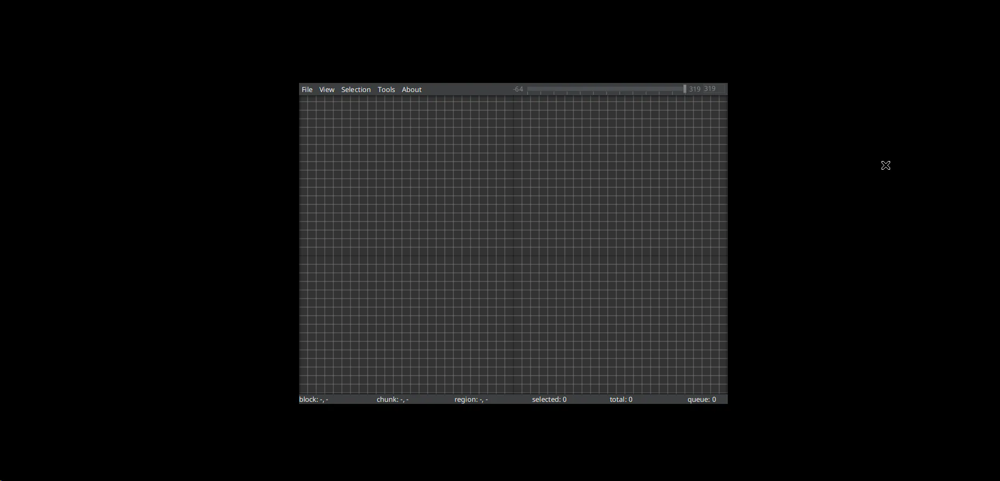
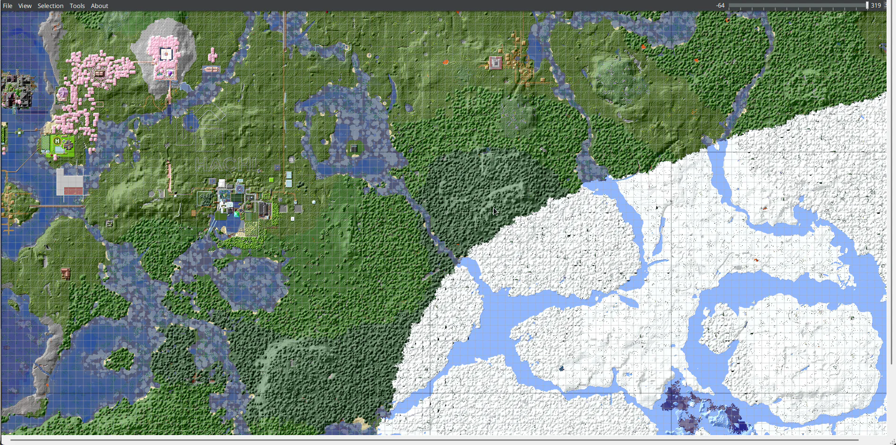

I'm running a Minecraft server that was recently updated to the latest version. To prepare for generating new biomes, I need to clear some unused chunks, which requires MCA Selector - a software that needs a GUI environment. The map files are quite large (over 1GB), so downloading them, editing locally, and re-uploading would be too cumbersome. I needed to find a way to use this software directly on the server.

There are two approaches:

1. Install a desktop environment, such as lightweight XFCE
2. Use a virtual desktop

Thanks to Linux's flexibility, I chose option 2 since installing a desktop environment would require several gigabytes of space for something I'd rarely use. We'll use x11 for this purpose by installing the following software:

```bash
apt install -y xvfb x11vnc
```

This installs the virtual desktop environment. Next, start the desktop with:

```bash
nohup Xvfb :1 -screen 0 1920x1080x24 -ac -dpi 96 +extension RANDR -nolock > xvfb.log 2>&1 &
x11vnc -display :1 -forever -bg -rfbport 35999
```

The first command uses xvfb to start a 1080p virtual desktop on display `:1` in the background. The second command starts a VNC server on port 35999, allowing us to connect via VNC.

Now we can run our software. We'll need a JDK/JRE with JavaFX support, which can be downloaded from: [Java 8, 11, 17, 21, 23 Download for Linux, Windows and macOS](https://www.azul.com/downloads/)

```bash
DISPLAY=:1 java -Xmx6G -jar mcaselector-2.5.1.jar
```

`DISPLAY=:1` directs the output to display 1, as shown in the image:



The window appears quite small, and there's no way to resize it by dragging. In this situation, we need to open another SSH connection and use xdotool to control the program programmatically. First, let's list all window contents:

```bash
DISPLAY=:1 xdotool search . getwindowname %@
```

This returns:

```bash
Defaulting to search window name, class, and classname
java
java-lang-Thread
MCA Selector 2.5.1
```

Now we need to find the window ID for MCA Selector:

```bash
DISPLAY=:1 xdotool search "MCA Selector 2.5.1"
```

Result:

```bash
Defaulting to search window name, class, and classname
14680067
```

This number may differ for each user. Next, move the window to the top-left corner and maximize its size:

```bash
DISPLAY=:1 xdotool windowmove 14680067 0 0
DISPLAY=:1 xdotool windowsize 14680067 1920 1080
```



Now the window is maximized.

Here are some additional xdotool commands for future reference:

```bash
xdotool key [key name]
xdotool key alt+Tab
xdotool type ''
xdotool search --name [window name] key [key name] # Find window and press key
xdotool mousemove x y
xdotool mousemove x y click 1  # 1-left button, 2-wheel, 3-right button, 4-scroll up, 5-scroll down
xdotool search --title "..."
xdotool key Return  # Simulate Enter key
xdotool keydown/keyup super # Press and hold Win key
xdotool key Super_L # Left Win key
watch -n 10 xdotool key Return # Combined with watch, press Enter every 10 seconds
xdotool search "Firefox"  # Get window name
xdotool getwindowname 39845889 # Get container name from ID listed above
xdotool getactivewindow # Get currently active window
xdotool windowminimize # Minimize window
xdotool windowminimize $(xdotool getactivewindow) # Minimize current window
xdotool key ctrl+l BackSpace # Press ctrl+l, then BackSpace
xdotool search --name gdb key ctrl+c # Press ctrl+c on window named gdb
xdotool mousemove_relative 10 10 # Relative mouse movement
xdotool mousemove_relative --sync 10 10 # Asynchronous relative mouse movement
xdotool click -repeat 1 3  # Right-click once
xdotool mousedown/mouseup
xdotool getmouselocation # Get mouse position
xdotool getmouselocation --shell # Get mouse position (easy to parse)
1 eval $(xdotool getmouselocation --shell)
2 echo $X,$Y
# To get X,Y position
xdotool getactivewindow windowmove 10 10 # Move current window

xdotool search . getwindowpid %@ # Find all windows and their process IDs (same PID means same process)

xdotool search . getwindowname %@ # Find all windows and display their titles
```
