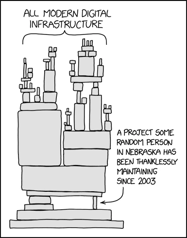


**注意：** 本文为翻译文章，原文链接为 [Software Maxims](https://www.softwaremaxims.com/blog/not-a-supplier)。 作者为 Thomas Depierre。


过去几年中，关于“软件供应链”这一概念的讨论越来越多。这些讨论从 LeftPad 事件开始，在近年来随着多起事故的发生而逐渐升级。然而，所有这些讨论忽略了一个基本问题。

在解释这一点之前，我将首先定义供应链和供应商的通常含义，以及为什么我们将它们应用于软件领域。接着，我将解释为什么将自由和开源软件（FOSS）纳入这种定义的尝试是极其错误的。

## 概念

在过去的几十年里，自由和开源软件（FOSS）崛起了。尤其是，它促使了代码片段的重用，以库的形式打包起来。之所以能够实现这一点，是因为围绕这一理念形成了一个庞大的基础设施生态系统。如今，几乎每种编程语言都有对应的包管理器，中央存储库负责存储元数据，帮助开发者找到库并管理其分发。

这得益于 FOSS 许可证相当宽松的规定，允许开发者重用和重新混合这些库，而不必面对繁琐的法律和财务问题。一个现代软件项目可能会依赖数百甚至上千个库，从 OpenSSL 到测试框架或日期选择器，涵盖范围广泛的库，例如 JSON 编码/解码库，甚至包括部署操作系统的 libc。

这种依赖生态系统中，许多依赖是传递性的（即依赖的依赖），这就是软件供应链模型所谓的项目供应链。在这种模型中，我们会发现一些管理工具，比如软件材料清单（SBOM），用于记录项目所用库的信息，包括库的来源、版本、内容哈希值等。

## 什么是供应链？

供应链的概念并非凭空而来。在制造业中，供应链是生产某种工厂产品所需的一长串供应商。例如，生产汽车需要座椅、许多螺丝、线缆、电子元件、各种冲压金属板等。而线缆供应商需要铜、塑料、能源，以及各种机器工具。这些机器工具可能也需要其他机器工具来生产，还需要螺丝、螺栓、电子元件等……如此类推，直到你的供应链图看起来像是一团乱麻。

然后，如果德国某个不知名的小工厂的工人病倒了，而供应链上五个级别的每个人都依赖于他们生产的某种螺栓，那我们就陷入困境了。类似的问题在 COVID-19 疫苗的生产中也曾发生过，当时供应链专家发现全球一年无法生产足够多的玻璃瓶来满足需求。

为了避免供应链深处的任何问题导致宝贵的生产停滞，制造公司多年来付出了大量努力来与各级供应商建立关系。这种关系既深且复杂，但通常也永远不够充分——每个复杂系统都如此，不是吗？

## 为什么我们现在谈论软件供应链？

因为公司不断发现它们产品中的大问题，并不是源于自己软件工程师写的代码。问题可能来自某个库的维护者决定停止提供该库的访问权限（如 LeftPad 事件），导致互联网的半壁江山瘫痪。

问题也可能来自某个被广泛使用的库（如 OpenSSL 或 Log4J）被发现存在巨大的安全漏洞，使得互联网上的半数设备变得易受攻击。

或者，有人可能与这些库的维护者交谈，说他们是来帮助的，获得访问权限后在代码中植入加密货币挖矿代码以牟取私利（这类事件数不胜数）。

再或者，代码所有者可能决定他不喜欢某些人支持战争政权，于是他会在代码中加入破坏性代码，摧毁那些使用其代码的工程师的电脑，只要他们生活在世界的某个地区（确实发生过几次这样的事件）。

于是，这些公司的每个人都惊觉到，他们的产品因依赖一些未知的代码而面临严重的“远程威胁”。因此，“软件供应链”这一概念应运而生，目的是定义供应链中人们——这些库的维护者——需要做什么才能成为不损害下游公司的好公民。

这些规则涵盖了如何测试代码、如何保护代码的访问权限、如何发布版本、如何验证代码的安全性、如何组织代码的工作方式、如何保护控制代码的个人账户等内容。

## 我不是供应商

但这里有一个小问题。我们不是供应商。编写和维护这些项目的人，我们不是供应商。我们与这些组织没有商业关系。我们是志愿者，编写代码并根据许可证将其发布到网上。是的，我们将代码放在网上供人使用。但我们从中什么都没有得到。

更糟的是，支撑整个数字经济的许多基础库甚至连维持生活的资金都难以获得。关于这个问题，我强烈建议大家花时间阅读 [Nadia Eghbal 的《桥梁与道路》报告](https://www.fordfoundation.org/work/learning/research-reports/roads-and-bridges-the-unseen-labor-behind-our-digital-infrastructure/)，以了解问题的深度。虽然它是在 HeartBleed 事件之后写的，已经有点旧了，但时至今日依然具有深刻的现实意义。

或者，如果你想要一个更有趣、更直观的解释，可以看看 [XKCD 第 2347 话](https://xkcd.com/2347/)。

XKCD 第 2347 话展示了一堆方块，标注为“所有现代数字基础设施”，其中一个小方块支撑着整个堆，标注为“一个从 2003 年起由内布拉斯加州某位不知名人士无偿维护的项目”。

我们清楚这一点。因此，在这些控制库重用的许可证中，你会发现一个逐字复制的段落：

> “本软件依‘原样’提供，不提供任何形式的明示或暗示担保，包括但不限于适销性、特定用途的适用性和非侵权的担保。无论是在合同、侵权或其他行为中，作者或版权持有人在任何情况下都不对因本软件或本软件的使用或其他交易引起的任何索赔、损害或其他责任承担责任。”

这个段落可能看起来有点法律术语化，而且确实显得很刺耳，但我可以很简单地总结它的含义。如果你使用它，我不欠你任何东西。完全没有。我们之间没有任何关系。我将它放到网上的条件是，如果你使用它，所有风险都由你承担。

这意味着这里没有供应链，因为没有供应商。我没有向你提供你从我这里购买的东西。我们之间没有关系。我发布代码是因为我愿意。你让你的产品依赖它是你的责任。不是我的，也不是其他维护者的。我们提供的是库，而不是供应品。你不能将规则强加于我。

老实说，我也不会接受这些规则。我几乎没有时间维护我负责的 FOSS 库，而定期的维护工作常常会让人感到筋疲力尽。

当然，我非常愿意成为一个供应商。你希望我按某种方式工作，我也非常愿意这样做。但为了实现这一点，我得先成为一个供应商。这意味着你需要开始付钱给我。一个公平的价格，咱们可以谈判。并且使用一份不同的许可证。

在那之前，我不是你的供应商。所以所有关于软件供应链的想法？你不是从供应商那里购买的，你是像浣熊一样在垃圾桶里翻找免费的代码。因此，我建议你把这些规则也丢进同一个垃圾桶里。记住，我不是供应商，因为

**本软件依“原样”提供。**
